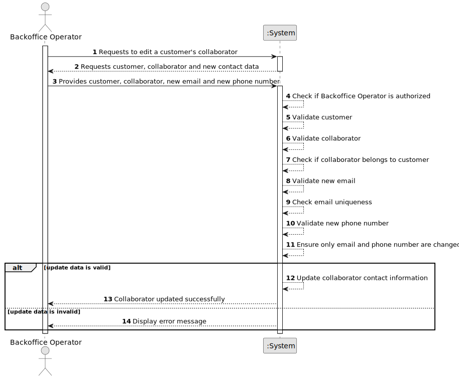

# US063 - Edit a Customer's Collaborator

## 1. Requirements Engineering

### 1.1. User Story Description

As a Backoffice Operator, I want to edit the information of a customer's collaborator.

This functionality allows a Backoffice Operator to update a customer's collaborator contact information. Only the collaborator's email and phone number can be changed. All other information, such as name, position and customer association, cannot be changed through this user story.

---

### 1.2. Customer Specifications and Clarifications

**From the specifications document:**

* A customer may be an air transport company or an air control area.
* A customer's collaborator is also a system user.
* Each collaborator is a distinct system user.
* The set of active collaborators will change over time.
* A Backoffice Operator can edit a customer's collaborator.
* Only email and phone number can be edited.
* All other information cannot be changed.
* Authentication and authorization must be enforced for all users and functionalities.

**From the client clarifications:**

No additional client clarifications are currently available.

---

### 1.3. Acceptance Criteria

* **AC1:** The Backoffice Operator must be able to edit a customer's collaborator.
* **AC2:** The selected customer must exist in the system.
* **AC3:** The selected collaborator must exist in the system.
* **AC4:** The selected collaborator must belong to the selected customer.
* **AC5:** The Backoffice Operator must be able to change the collaborator's email.
* **AC6:** The Backoffice Operator must be able to change the collaborator's phone number.
* **AC7:** The new email must be valid.
* **AC8:** The new email must be unique among system users.
* **AC9:** The new phone number must be valid.
* **AC10:** The system must not allow changing the collaborator's name.
* **AC11:** The system must not allow changing the collaborator's position.
* **AC12:** The system must not allow changing the collaborator's customer association.
* **AC13:** The system must update the corresponding system user information.
* **AC14:** Only an authenticated and authorized Backoffice Operator can edit customer collaborators.
* **AC15:** The system must display a success message when the update succeeds.
* **AC16:** The system must display an error message when the update fails.

---

### 1.4. Found out Dependencies

* This user story depends on US030, because only authenticated and authorized users should be able to access this functionality.
* This user story depends on US061, because collaborators must be registered before they can be edited.
* This user story depends on US062, because collaborators can be listed before selecting one to edit.
* This user story is related to US064, because disabled collaborators may still exist in the system.
* This user story depends on the collaborator also being a system user.

---

### 1.5. Input and Output Data

**Input Data:**

* Selected data:
    * Customer
    * Customer collaborator

* Typed data:
    * New email
    * New phone number

**Output Data:**

* In case of success:
    * Success message
    * Updated collaborator contact information

* In case of failure:
    * Error message explaining why the collaborator could not be updated

---

### 1.6. System Sequence Diagram

**_Other alternatives might exist._**

---

### 1.7. Other Relevant Remarks

* This user story only allows editing email and phone number.
* Name, position and customer association must remain unchanged.
* Since the collaborator is also a system user, updating the collaborator's email and phone number must update the corresponding user information.
* Email uniqueness must be checked at system user level.
* The system must not require the collaborator email to belong to the customer's domain.