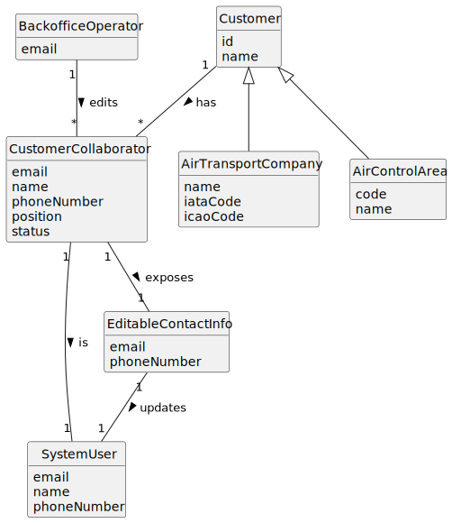

# US063 - Edit a Customer's Collaborator

## 2. Analysis

### 2.1. Relevant Domain Concepts

The relevant domain concepts for this user story are:

* **Backoffice Operator:** user responsible for managing customer collaborators.
* **Customer:** entity that may be an air transport company or an air control area.
* **Customer Collaborator:** collaborator associated with a customer.
* **System User:** user account associated with the collaborator.
* **Email:** unique identifier of the system user.
* **Phone Number:** contact information associated with the system user.
* **Position:** collaborator's position, which cannot be changed in this user story.
* **Customer Association:** relationship between the collaborator and customer, which cannot be changed in this user story.

---

### 2.2. Business Rules

* Only an authorized Backoffice Operator can edit a customer's collaborator.
* The customer must exist.
* The collaborator must exist.
* The collaborator must belong to the selected customer.
* Only email and phone number can be changed.
* The collaborator's name cannot be changed.
* The collaborator's position cannot be changed.
* The collaborator's customer association cannot be changed.
* The new email must be valid.
* The new email must be unique among system users.
* The new phone number must be valid.
* Updating collaborator contact information must update the corresponding system user information.
* The system must not require the collaborator email to belong to the customer's domain.

---

### 2.3. Preconditions

* The Backoffice Operator must be authenticated.
* The Backoffice Operator must be authorized to edit customer collaborators.
* The selected customer must exist.
* The selected collaborator must exist.
* The collaborator must be associated with the selected customer.

---

### 2.4. Postconditions

**Successful update:**

* The collaborator's email and/or phone number is updated.
* The corresponding system user information is updated.
* The collaborator's name remains unchanged.
* The collaborator's position remains unchanged.
* The collaborator remains associated with the same customer.

**Failed update:**

* The collaborator remains unchanged.
* The corresponding system user remains unchanged.
* An error message is displayed.

---

### 2.5. Domain Model

