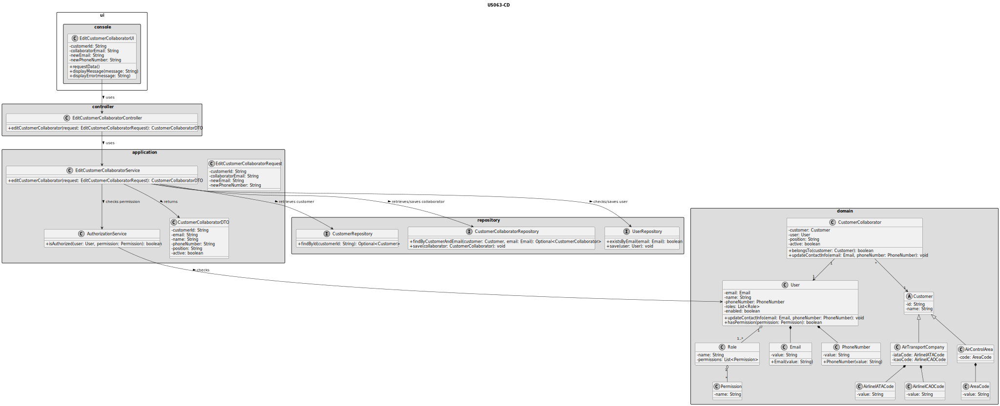
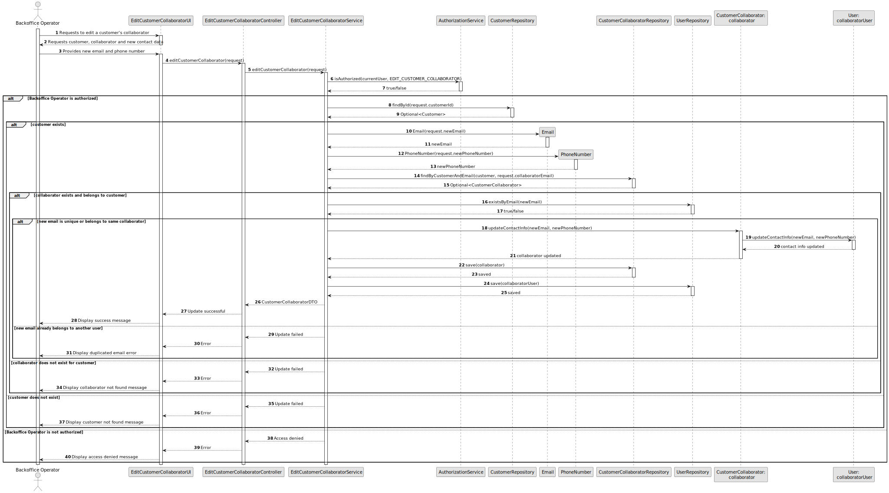

# US063 - Edit a Customer's Collaborator

## 3. Design

### 3.1. Responsibility Assignment

The customer collaborator edition process is divided between the following components:

* **EditCustomerCollaboratorUI:** interacts with the Backoffice Operator and collects the selected collaborator and new contact data.
* **EditCustomerCollaboratorController:** receives the edit request from the UI.
* **EditCustomerCollaboratorService:** coordinates authorization, customer/collaborator lookup, validation and update.
* **AuthorizationService:** verifies if the current user has permission to edit customer collaborators.
* **CustomerRepository:** retrieves the selected customer.
* **CustomerCollaboratorRepository:** retrieves and stores the collaborator.
* **UserRepository:** checks email uniqueness and updates the corresponding system user.
* **CustomerCollaborator:** domain entity representing the collaborator.
* **User:** domain entity representing the corresponding system user.
* **Email:** value object representing the new email.
* **PhoneNumber:** value object representing the new phone number.

---

### 3.2. Class Diagram

---

### 3.3. Sequence Diagram

---

### 3.4. Applied Patterns

* **UI:** responsible for collecting input from the Backoffice Operator.
* **Controller:** receives and delegates the request.
* **Service:** coordinates authorization, validation and persistence.
* **Repository:** abstracts customer, collaborator and user persistence.
* **Entity:** represents users, customers and collaborators.
* **Value Object:** represents email and phone number.
* **DTO:** transfers updated collaborator data to the UI.

---

### 3.5. Design Remarks

* The UI must not access repositories directly.
* The Controller should not contain business rules.
* The Service should coordinate authorization, lookup and update.
* Only email and phone number should be accepted as editable fields.
* The collaborator's name, position and customer association must remain unchanged.
* Email uniqueness must be checked at user repository level.
* Updating the collaborator should update the corresponding system user.