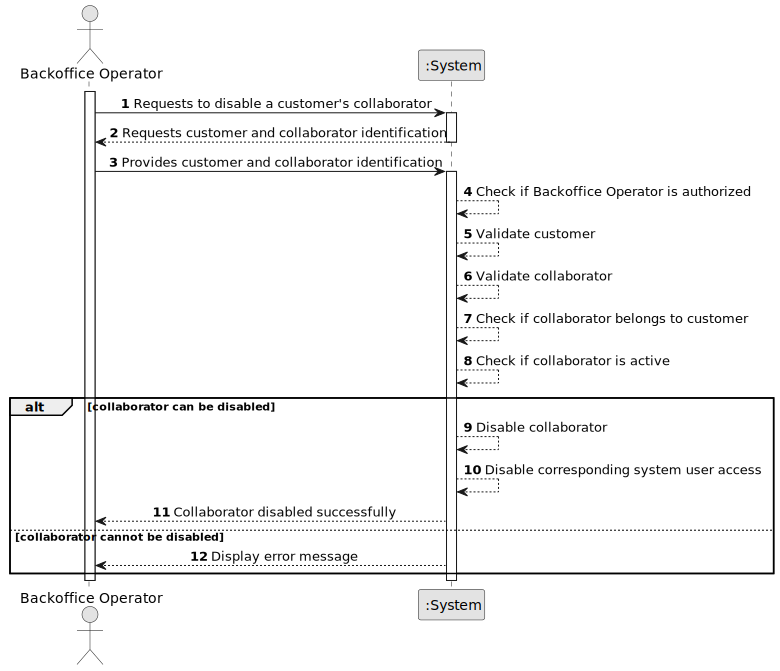

# US064 - Disable a Customer's Collaborator

## 1. Requirements Engineering

### 1.1. User Story Description

As a Backoffice Operator, I want to disable a customer's collaborator so that he may not use the system anymore.

This functionality allows a Backoffice Operator to make a customer's collaborator inactive. A disabled collaborator must no longer be able to use the system. The collaborator should not be deleted, since the system may need to preserve information about previous collaborators.

---

### 1.2. Customer Specifications and Clarifications

**From the specifications document:**

* A customer may be an air transport company or an air control area.
* A customer's collaborator is also a system user.
* Each collaborator is a distinct system user.
* The set of active collaborators will change over time.
* A Backoffice Operator can disable a customer's collaborator.
* A disabled collaborator should not be able to use the system anymore.
* Disabled collaborators should not appear when listing active collaborators.
* Authentication and authorization must be enforced for all users and functionalities.

**From the client clarifications:**

No additional client clarifications are currently available.

---

### 1.3. Acceptance Criteria

* **AC1:** The Backoffice Operator must be able to disable a customer's collaborator.
* **AC2:** The selected customer must exist in the system.
* **AC3:** The selected collaborator must exist in the system.
* **AC4:** The selected collaborator must belong to the selected customer.
* **AC5:** The system must change the collaborator status to disabled.
* **AC6:** A disabled collaborator must not be able to use the system.
* **AC7:** A disabled collaborator must not appear in the list of active customer collaborators.
* **AC8:** Disabling a collaborator must not delete the collaborator from the system.
* **AC9:** Disabling a collaborator must not delete the corresponding system user.
* **AC10:** The corresponding system user must be disabled or prevented from authenticating.
* **AC11:** Only an authenticated and authorized Backoffice Operator can disable customer collaborators.
* **AC12:** The system must display a success message when the collaborator is disabled successfully.
* **AC13:** The system must display an error message when the operation fails.

---

### 1.4. Found out Dependencies

* This user story depends on US030, because only authenticated and authorized users should be able to access this functionality.
* This user story depends on US061, because collaborators must be registered before they can be disabled.
* This user story depends on US062, because disabled collaborators must not appear in the active collaborators list.
* This user story depends on US032 or shares its logic, because the corresponding system user should be prevented from using the system.
* This user story is related to US063, because collaborator information may be edited before being disabled.

---

### 1.5. Input and Output Data

**Input Data:**

* Selected data:
    * Customer
    * Customer collaborator

**Output Data:**

* In case of success:
    * Success message
    * Updated collaborator status

* In case of failure:
    * Error message explaining why the collaborator could not be disabled

---

### 1.6. System Sequence Diagram

**_Other alternatives might exist._**

---

### 1.7. Other Relevant Remarks

* Disabling a collaborator is not the same as deleting a collaborator.
* Disabled collaborators should remain stored in the system.
* The collaborator's corresponding system user must not be able to authenticate after disabling.
* This operation should preserve historical associations between customer and collaborator.
* The system should keep this behavior consistent with US032, which disables system users.