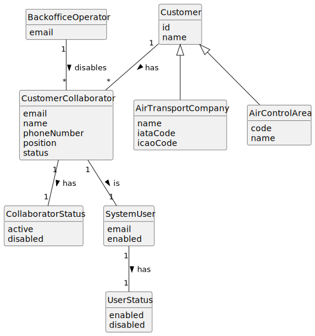

# US064 - Disable a Customer's Collaborator

## 2. Analysis

### 2.1. Relevant Domain Concepts

The relevant domain concepts for this user story are:

* **Backoffice Operator:** user responsible for managing customer collaborators.
* **Customer:** entity that may be an air transport company or an air control area.
* **Customer Collaborator:** collaborator associated with a customer.
* **Collaborator Status:** indicates whether the collaborator is active or disabled.
* **System User:** user account associated with the collaborator.
* **User Status:** indicates whether the associated system user can authenticate and use the system.
* **Customer Association:** relationship between the collaborator and the selected customer.

---

### 2.2. Business Rules

* Only an authorized Backoffice Operator can disable a customer's collaborator.
* The selected customer must exist.
* The selected collaborator must exist.
* The collaborator must belong to the selected customer.
* Only active collaborators can be disabled.
* Disabling a collaborator must not delete the collaborator.
* Disabling a collaborator must not delete the corresponding system user.
* A disabled collaborator must not be able to use the system.
* A disabled collaborator must not appear in the active collaborators list.
* The corresponding system user must be disabled or otherwise prevented from authenticating.
* The system state must remain unchanged if the operation fails.

---

### 2.3. Preconditions

* The Backoffice Operator must be authenticated.
* The Backoffice Operator must be authorized to disable customer collaborators.
* The selected customer must exist.
* The selected collaborator must exist.
* The collaborator must be associated with the selected customer.
* The collaborator must be active.

---

### 2.4. Postconditions

**Successful disable operation:**

* The collaborator status is changed to disabled.
* The corresponding system user is disabled or prevented from authenticating.
* The collaborator no longer appears in active collaborator listings.
* The collaborator remains stored in the system.

**Failed disable operation:**

* The collaborator status remains unchanged.
* The corresponding system user remains unchanged.
* The system state remains unchanged.
* An error message is displayed.

---

### 2.5. Domain Model

