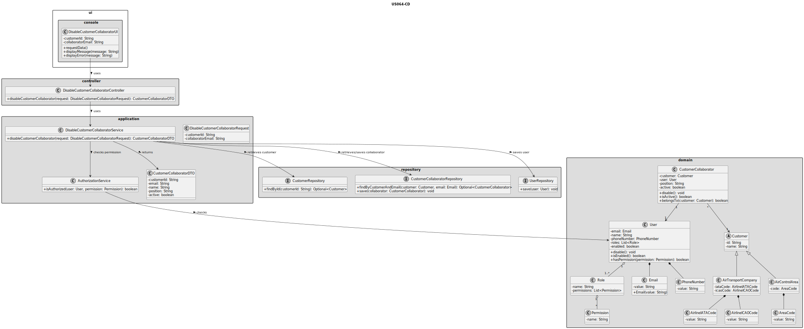
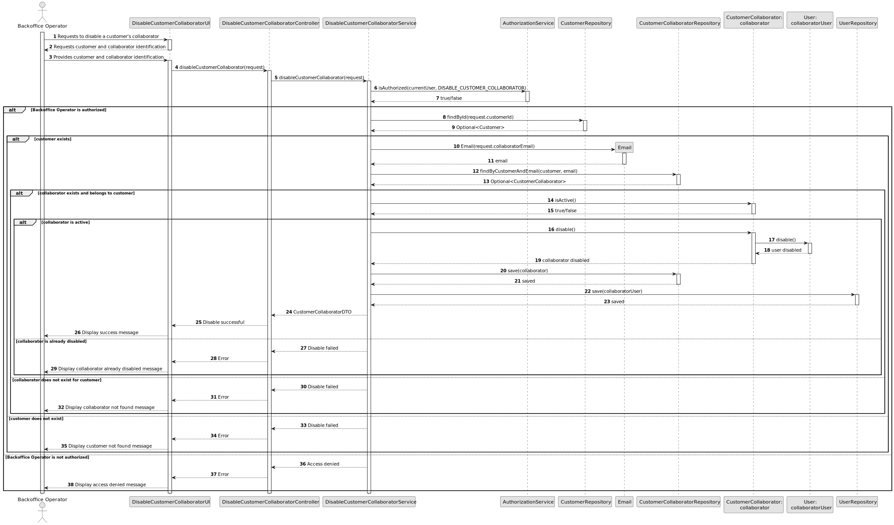

# US064 - Disable a Customer's Collaborator

## 3. Design

### 3.1. Responsibility Assignment

The customer collaborator disabling process is divided between the following components:

* **DisableCustomerCollaboratorUI:** interacts with the Backoffice Operator and collects the selected customer and collaborator.
* **DisableCustomerCollaboratorController:** receives the disable request from the UI.
* **DisableCustomerCollaboratorService:** coordinates authorization, customer/collaborator lookup and state change.
* **AuthorizationService:** verifies if the current user has permission to disable customer collaborators.
* **CustomerRepository:** retrieves the selected customer.
* **CustomerCollaboratorRepository:** retrieves and stores the collaborator.
* **UserRepository:** stores the updated corresponding system user.
* **CustomerCollaborator:** domain entity responsible for changing its own status.
* **User:** domain entity representing the corresponding system user.
* **Email:** value object used to identify the collaborator/user.

---

### 3.2. Class Diagram

---

### 3.3. Sequence Diagram

---

### 3.4. Applied Patterns

* **UI:** responsible for collecting input from the Backoffice Operator.
* **Controller:** receives and delegates the request.
* **Service:** coordinates authorization, lookup and persistence.
* **Repository:** abstracts customer, collaborator and user persistence.
* **Entity:** represents users, customers and collaborators.
* **Value Object:** represents email.
* **State Change:** collaborator and user status are changed without deleting stored data.

---

### 3.5. Design Remarks

* The UI must not access repositories directly.
* The Controller should not contain business rules.
* The Service should coordinate authorization, lookup and state changes.
* The collaborator should expose a method such as `disable()`.
* The corresponding system user should also be disabled or prevented from authenticating.
* Disabling a collaborator should not remove the collaborator from persistence.
* This behavior must remain consistent with active collaborator listing in US062.