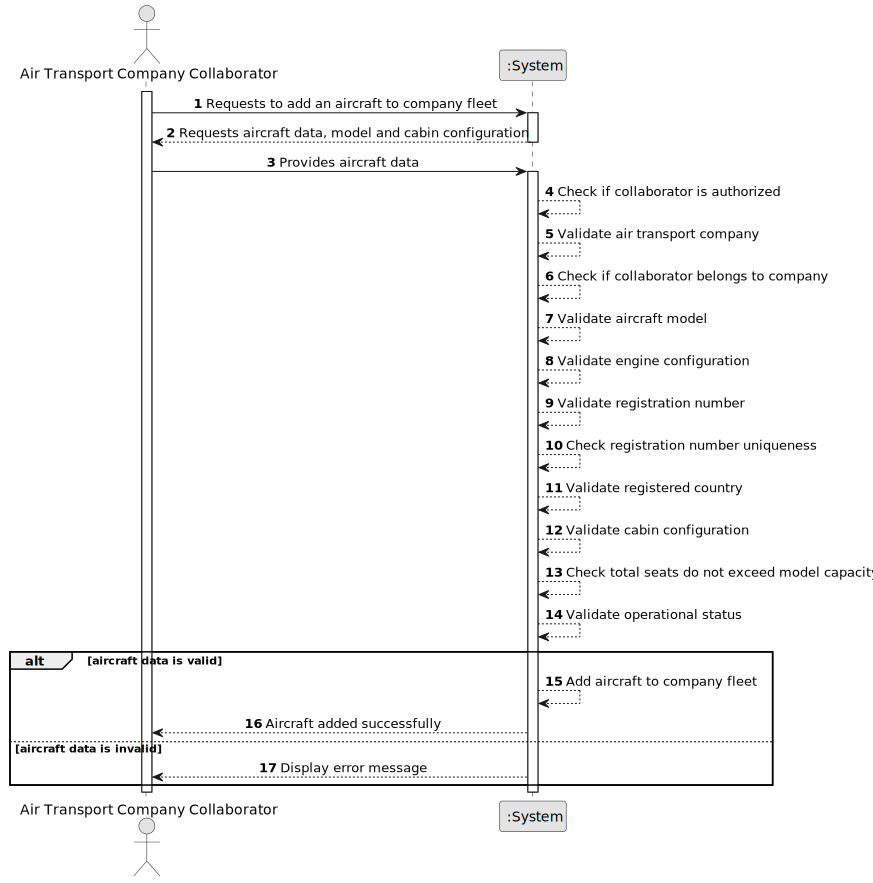

# US070 - Add an Aircraft to an Air Transport Company

## 1. Requirements Engineering

### 1.1. User Story Description

As an Air Transport Company Collaborator, I want to add an aircraft to my company's fleet.

This functionality allows an authorized Air Transport Company Collaborator to register an aircraft in their company's fleet. The aircraft must be associated with an existing aircraft model and a valid engine configuration. The aircraft must have a unique registration number, a registered country, an operational status and a cabin configuration with seats by class.

---

### 1.2. Customer Specifications and Clarifications

**From the specifications document:**

* Air transport companies use the system to register aircraft and flights.
* An Air Transport Company Collaborator can add an aircraft to their company's fleet.
* An aircraft is of a given model.
* The aircraft includes the engines.
* The number of seats of each type/class must be provided.
* The total number of seats cannot exceed the model's capacity.
* An aircraft is identified by a unique aircraft registration number.
* An aircraft is registered in a country, which may not be the company's home country.
* An aircraft has an operational status.
* Authentication and authorization must be enforced for all users and functionalities.

**From the client clarifications:**

No additional client clarifications are currently available.

---

### 1.3. Acceptance Criteria

* **AC1:** An Air Transport Company Collaborator must be able to add an aircraft to their company's fleet.
* **AC2:** The collaborator must belong to the air transport company receiving the aircraft.
* **AC3:** The selected air transport company must exist.
* **AC4:** The selected aircraft model must exist.
* **AC5:** The selected engine configuration must be valid for the selected aircraft model.
* **AC6:** The aircraft must have a registration number.
* **AC7:** The aircraft registration number must be unique.
* **AC8:** The aircraft must have a registered country.
* **AC9:** The aircraft must have a cabin configuration.
* **AC10:** The number of seats for each class must be provided.
* **AC11:** The total number of seats must not exceed the model's capacity.
* **AC12:** The aircraft must have an operational status.
* **AC13:** The system must store the aircraft in the company's fleet after successful registration.
* **AC14:** Only an authenticated and authorized Air Transport Company Collaborator can add aircraft to their company.
* **AC15:** The system must display a success message when the aircraft is added successfully.
* **AC16:** The system must display an error message when the operation fails.

---

### 1.4. Found out Dependencies

* This user story depends on US030, because authentication and authorization must be enforced.
* This user story depends on US060, because the air transport company must exist.
* This user story depends on US061, because the actor must be a collaborator of the company.
* This user story depends on US055, because the aircraft must be of an existing aircraft model.
* This user story depends on US056 and US057, because the aircraft must use a valid engine model certified for the selected aircraft model.
* This user story is related to US071, because aircraft can later be decommissioned.
* This user story is related to US072, because the company's fleet can later be listed.
* This user story is related to US080, because flight plans require aircraft.

---

### 1.5. Input and Output Data

**Input Data:**

* Selected data:
    * Air transport company
    * Aircraft model
    * Certified engine model or engine configuration
    * Registered country
    * Operational status

* Typed data:
    * Aircraft registration number
    * Number of seats by class

**Possible cabin classes:**

* Economy
* Premium Economy
* Business
* First
* Cargo capacity, if applicable in future refinement

**Output Data:**

* In case of success:
    * Success message
    * Registered aircraft information

* In case of failure:
    * Error message explaining why the aircraft could not be added to the fleet

---

### 1.6. System Sequence Diagram

**_Other alternatives might exist._**

---

### 1.7. Other Relevant Remarks

* The aircraft belongs to exactly one air transport company at registration.
* The aircraft registration number should be treated as a stable unique identifier.
* The aircraft must not be created with a seat capacity above the selected model's capacity.
* The aircraft's registered country may be different from the company's home country.
* The aircraft should be created with an operational status that allows later rules such as decommissioning.