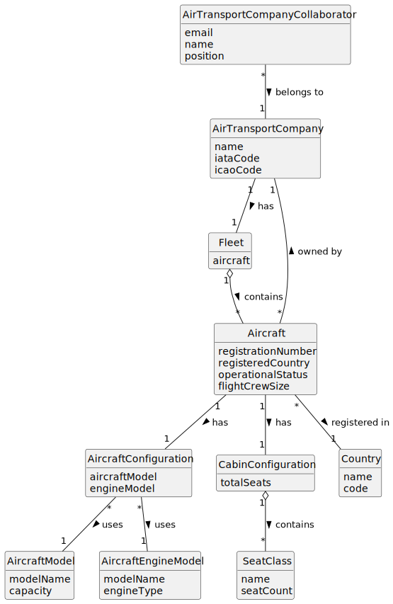

# US070 - Add an Aircraft to an Air Transport Company

## 2. Analysis

### 2.1. Relevant Domain Concepts

The relevant domain concepts for this user story are:

* **Air Transport Company Collaborator:** user associated with an air transport company and allowed to manage company resources.
* **Air Transport Company:** company that owns the aircraft fleet.
* **Fleet:** set of aircraft belonging to an air transport company.
* **Aircraft:** actual aircraft registered in the system.
* **Aircraft Registration Number:** unique identifier of an aircraft.
* **Aircraft Model:** model of the aircraft.
* **Aircraft Engine Model:** engine model used by the aircraft.
* **Aircraft Configuration:** combination of aircraft model and engine configuration.
* **Cabin Configuration:** number of seats by class.
* **Registered Country:** country where the aircraft is registered.
* **Operational Status:** current operational state of the aircraft.

---

### 2.2. Business Rules

* Only an authorized Air Transport Company Collaborator can add aircraft to their company's fleet.
* The collaborator must belong to the selected air transport company.
* The selected air transport company must exist.
* The selected aircraft model must exist.
* The selected engine configuration must be valid for the aircraft model.
* The aircraft must have a unique registration number.
* The aircraft must have a registered country.
* The aircraft must have a cabin configuration.
* The total number of seats cannot exceed the model's capacity.
* Seat numbers cannot be negative.
* The aircraft must have an operational status.
* A successfully registered aircraft becomes part of the company's fleet.

---

### 2.3. Preconditions

* The Air Transport Company Collaborator must be authenticated.
* The collaborator must be authorized to add aircraft.
* The collaborator must belong to the selected company.
* The selected air transport company must exist.
* The selected aircraft model must exist.
* The selected engine model/configuration must be certified for the aircraft model.

---

### 2.4. Postconditions

**Successful registration:**

* A new aircraft is created.
* The aircraft is associated with the selected air transport company.
* The aircraft becomes part of the company's fleet.
* The aircraft can later be listed and used in flight planning if operational rules allow it.

**Failed registration:**

* No aircraft is created.
* The company's fleet remains unchanged.
* An error message is displayed.

---

### 2.5. Domain Model

