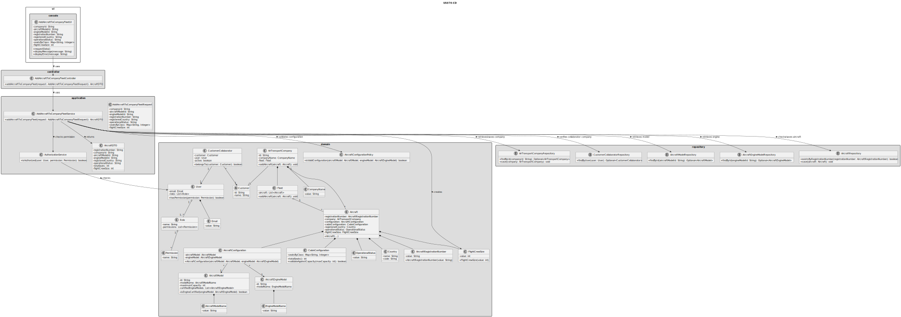
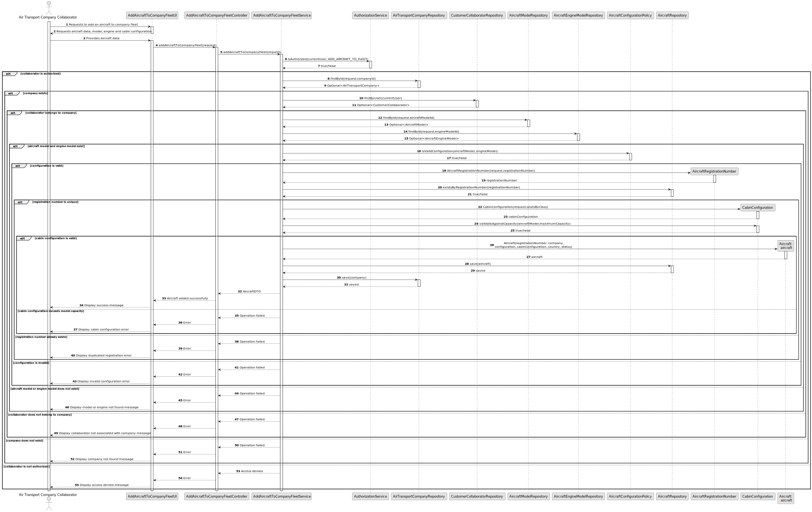

# US070 - Add an Aircraft to an Air Transport Company

## 3. Design

### 3.1. Responsibility Assignment

The aircraft registration process is divided between the following components:

* **AddAircraftToCompanyFleetUI:** interacts with the Air Transport Company Collaborator and collects aircraft data.
* **AddAircraftToCompanyFleetController:** receives the request from the UI.
* **AddAircraftToCompanyFleetService:** coordinates authorization, company validation, aircraft model lookup, configuration validation and persistence.
* **AuthorizationService:** verifies if the current user has permission to add aircraft.
* **AirTransportCompanyRepository:** retrieves the selected company.
* **CustomerCollaboratorRepository:** verifies that the current user belongs to the selected company.
* **AircraftModelRepository:** retrieves the selected aircraft model.
* **AircraftEngineModelRepository:** retrieves the selected engine model.
* **AircraftRepository:** checks registration uniqueness and stores the new aircraft.
* **Aircraft:** domain entity representing the actual aircraft.
* **AircraftRegistrationNumber:** value object representing the unique registration number.
* **AircraftConfiguration:** domain object representing model and engine configuration.
* **CabinConfiguration:** domain object responsible for validating seat counts.
* **AircraftConfigurationPolicy:** domain policy responsible for validating if the selected engine model is certified for the aircraft model.
* **FlightCrewSize:** value object responsible for validating the number of flight crew members.

---

### 3.2. Class Diagram

---

### 3.3. Sequence Diagram

---

### 3.4. Applied Patterns

* **UI:** responsible for collecting input from the Air Transport Company Collaborator.
* **Controller:** receives and delegates the request.
* **Service:** coordinates the use case.
* **Repository:** abstracts lookup and persistence.
* **Entity:** represents aircraft and companies.
* **Value Object:** represents registration number, cabin configuration values and flight crew size.
* **Domain Policy:** validates aircraft model and engine configuration compatibility.
* **DTO:** transfers registered aircraft data to the UI.

---

### 3.5. Design Remarks

* The UI must not access repositories directly.
* The Controller should not contain business rules.
* The Service should coordinate authorization, lookup and persistence.
* The aircraft registration number must be unique.
* Cabin configuration should protect the invariant that total seats do not exceed model capacity.
* The selected engine model must be certified for the selected aircraft model.
* The collaborator must belong to the company receiving the aircraft.
* The number of flight crew members should be validated as a positive integer.