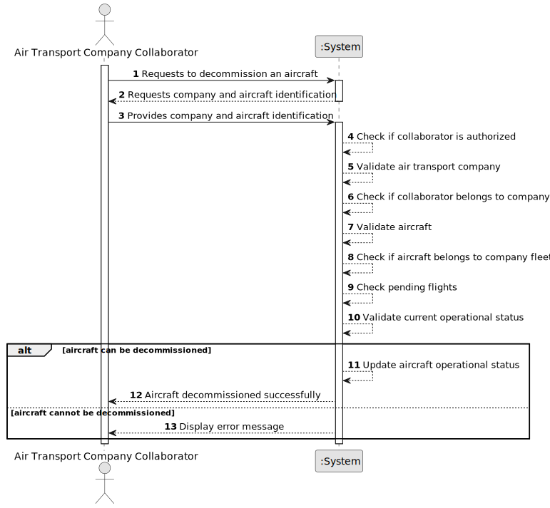

# US071 - Decommission an Aircraft

## 1. Requirements Engineering

### 1.1. User Story Description

As an Air Transport Company Collaborator, I want to decommission an aircraft of my company's fleet.

This functionality allows an authorized Air Transport Company Collaborator to decommission an aircraft that belongs to their company's fleet. The aircraft is not removed from the fleet. Instead, its operational status is updated so that it can no longer be used as an active operational aircraft.

---

### 1.2. Customer Specifications and Clarifications

**From the specifications document:**

* An Air Transport Company Collaborator can decommission an aircraft of their company's fleet.
* The aircraft is not removed from the company's fleet.
* The aircraft operational status is updated.
* It cannot have pending flights.
* An aircraft belongs to an air transport company's fleet.
* Authentication and authorization must be enforced for all users and functionalities.

**From the client clarifications:**

No additional client clarifications are currently available.

---

### 1.3. Acceptance Criteria

* **AC1:** An Air Transport Company Collaborator must be able to decommission an aircraft from their company's fleet.
* **AC2:** The collaborator must belong to the company that owns the aircraft.
* **AC3:** The selected aircraft must exist in the system.
* **AC4:** The selected aircraft must belong to the collaborator's company.
* **AC5:** The aircraft must not have pending flights.
* **AC6:** The aircraft must not be removed from the company's fleet.
* **AC7:** The aircraft operational status must be updated to decommissioned.
* **AC8:** A decommissioned aircraft must not be available for future active flight assignment.
* **AC9:** Only an authenticated and authorized Air Transport Company Collaborator can decommission aircraft.
* **AC10:** The system must display a success message when the aircraft is decommissioned successfully.
* **AC11:** The system must display an error message when the operation fails.

---

### 1.4. Found out Dependencies

* This user story depends on US030, because authentication and authorization must be enforced.
* This user story depends on US060, because the air transport company must exist.
* This user story depends on US061, because the actor must be a collaborator of the company.
* This user story depends on US070, because the aircraft must already exist in the company's fleet.
* This user story is related to US072, because decommissioned aircraft may still appear in fleet listings depending on listing rules.
* This user story is related to US080 and future flight plan user stories, because aircraft with pending flights cannot be decommissioned.
* This user story is related to any future flight scheduling or flight status management functionality.

---

### 1.5. Input and Output Data

**Input Data:**

* Selected data:
    * Air transport company
    * Aircraft to decommission

**Output Data:**

* In case of success:
    * Success message
    * Updated aircraft information
    * Updated operational status

* In case of failure:
    * Error message explaining why the aircraft could not be decommissioned

---

### 1.6. System Sequence Diagram

**_Other alternatives might exist._**

---

### 1.7. Other Relevant Remarks

* Decommissioning an aircraft is not the same as deleting it.
* The aircraft must remain stored in the system and associated with the company's fleet.
* The operation should preserve aircraft history.
* Pending flights prevent decommissioning.
* Decommissioned aircraft should not be used for new flight assignments.