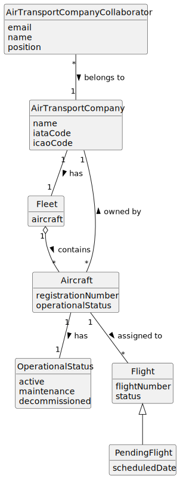

# US071 - Decommission an Aircraft

## 2. Analysis

### 2.1. Relevant Domain Concepts

The relevant domain concepts for this user story are:

* **Air Transport Company Collaborator:** user associated with an air transport company and allowed to manage company resources.
* **Air Transport Company:** company that owns the aircraft fleet.
* **Fleet:** set of aircraft belonging to an air transport company.
* **Aircraft:** actual aircraft registered in the system.
* **Aircraft Registration Number:** unique identifier of an aircraft.
* **Operational Status:** current operational state of the aircraft.
* **Pending Flight:** flight or flight plan that still depends on the aircraft and prevents decommissioning.
* **Decommissioning:** process of marking an aircraft as no longer operational without deleting it.

---

### 2.2. Business Rules

* Only an authorized Air Transport Company Collaborator can decommission aircraft from their company's fleet.
* The collaborator must belong to the company that owns the aircraft.
* The aircraft must exist.
* The aircraft must belong to the selected company.
* The aircraft cannot have pending flights.
* The aircraft must not be removed from the fleet.
* The aircraft operational status must be updated.
* A decommissioned aircraft must not be available for new active flight assignments.
* The operation must preserve aircraft history.
* If the operation fails, the aircraft status must remain unchanged.

---

### 2.3. Preconditions

* The Air Transport Company Collaborator must be authenticated.
* The collaborator must be authorized to decommission aircraft.
* The collaborator must belong to the selected company.
* The selected aircraft must exist.
* The selected aircraft must belong to the selected company's fleet.
* The selected aircraft must not have pending flights.

---

### 2.4. Postconditions

**Successful decommissioning:**

* The aircraft operational status is changed to decommissioned.
* The aircraft remains associated with the company's fleet.
* The aircraft is no longer available for new active flight assignments.

**Failed decommissioning:**

* The aircraft operational status remains unchanged.
* The aircraft remains associated with the company's fleet.
* An error message is displayed.

---

### 2.5. Domain Model

