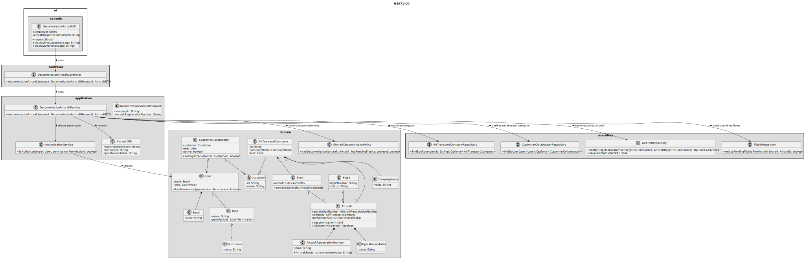
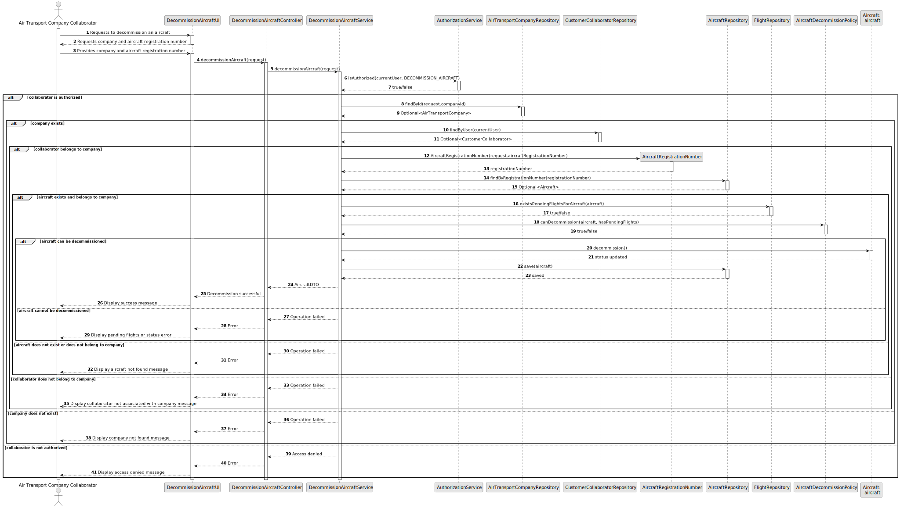

# US071 - Decommission an Aircraft

## 3. Design

### 3.1. Responsibility Assignment

The aircraft decommissioning process is divided between the following components:

* **DecommissionAircraftUI:** interacts with the Air Transport Company Collaborator and collects the selected aircraft.
* **DecommissionAircraftController:** receives the request from the UI.
* **DecommissionAircraftService:** coordinates authorization, company validation, aircraft lookup, pending flight validation and status update.
* **AuthorizationService:** verifies if the current user has permission to decommission aircraft.
* **AirTransportCompanyRepository:** retrieves the selected company.
* **CustomerCollaboratorRepository:** verifies that the current user belongs to the selected company.
* **AircraftRepository:** retrieves and stores the aircraft.
* **FlightRepository:** checks whether the aircraft has pending flights.
* **Aircraft:** domain entity responsible for changing its operational status.
* **OperationalStatus:** value object or enum representing aircraft status.
* **AircraftDecommissionPolicy:** domain policy responsible for checking whether the aircraft can be decommissioned.

---

### 3.2. Class Diagram

---

### 3.3. Sequence Diagram

---

### 3.4. Applied Patterns

* **UI:** responsible for collecting input from the Air Transport Company Collaborator.
* **Controller:** receives and delegates the request.
* **Service:** coordinates the use case.
* **Repository:** abstracts lookup and persistence.
* **Entity:** represents aircraft and companies.
* **Domain Policy:** centralizes decommissioning rules.
* **State Change:** changes aircraft operational status without deleting the aircraft.
* **DTO:** transfers updated aircraft data to the UI.

---

### 3.5. Design Remarks

* The UI must not access repositories directly.
* The Controller should not contain business rules.
* The Service should coordinate authorization, lookup, validation and persistence.
* The aircraft should expose a method such as `decommission()`.
* The aircraft must remain in the company's fleet.
* The system must check pending flights before changing the status.
* Decommissioned aircraft should be excluded from future flight assignment options.