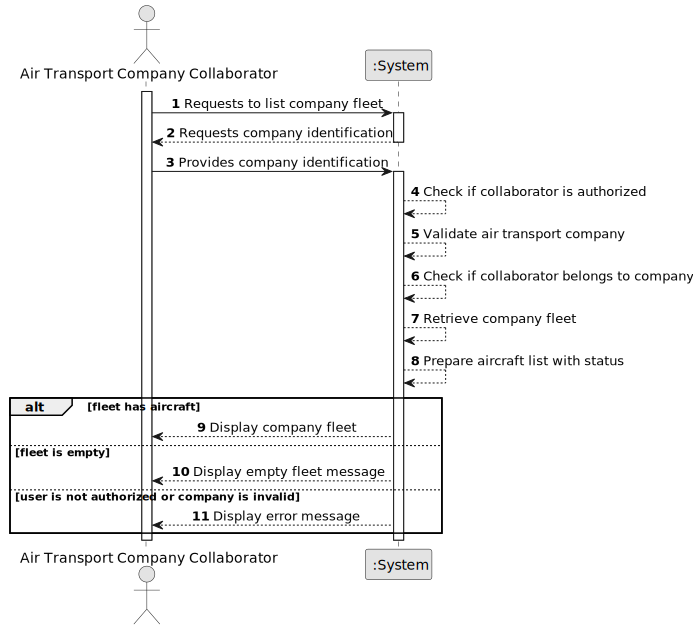

# US072 - List an Air Transport Company's Fleet

## 1. Requirements Engineering

### 1.1. User Story Description

As an Air Transport Company Collaborator, I want to list my company's fleet.

This functionality allows an authorized Air Transport Company Collaborator to consult the aircraft registered in their company's fleet. The list should provide relevant operational and technical information about each aircraft.

---

### 1.2. Customer Specifications and Clarifications

**From the specifications document:**

* Air transport companies use the system to register aircraft and flights.
* An Air Transport Company Collaborator can add aircraft to their company's fleet.
* An aircraft is not removed from the fleet when it is decommissioned.
* The aircraft operational status is updated when decommissioned.
* An Air Transport Company Collaborator can list the company's fleet.
* Authentication and authorization must be enforced for all users and functionalities.

**From the client clarifications:**

No additional client clarifications are currently available.

---

### 1.3. Acceptance Criteria

* **AC1:** An Air Transport Company Collaborator must be able to list their company's fleet.
* **AC2:** The collaborator must belong to the selected air transport company.
* **AC3:** The selected air transport company must exist.
* **AC4:** The list must include aircraft registration number.
* **AC5:** The list must include aircraft model.
* **AC6:** The list must include engine configuration.
* **AC7:** The list must include cabin configuration or total seat capacity.
* **AC8:** The list must include registered country.
* **AC9:** The list must include operational status.
* **AC10:** Decommissioned aircraft must not be deleted from the fleet.
* **AC11:** If the company has no aircraft, the system must display an appropriate empty list message.
* **AC12:** Only an authenticated and authorized Air Transport Company Collaborator can list the fleet.
* **AC13:** The listing operation must not modify fleet or aircraft data.

---

### 1.4. Found out Dependencies

* This user story depends on US030, because authentication and authorization must be enforced.
* This user story depends on US060, because the air transport company must exist.
* This user story depends on US061, because the actor must be a collaborator of the company.
* This user story depends on US070, because aircraft must be registered before they can be listed.
* This user story is related to US071, because decommissioned aircraft remain in the fleet and should be listed with their updated operational status.
* This user story is related to US072a, US072b, US072c and US072d, because those user stories provide specialized filtered or ordered fleet listings.

---

### 1.5. Input and Output Data

**Input Data:**

* Selected data:
    * Air transport company

**Output Data:**

* In case aircraft exist:
    * List of aircraft, including:
        * Registration number
        * Aircraft model
        * Engine configuration
        * Cabin configuration or total seats
        * Registered country
        * Operational status

* In case no aircraft exist:
    * Empty fleet message

* In case of failure:
    * Error message explaining why the fleet could not be listed

---

### 1.6. System Sequence Diagram

**_Other alternatives might exist._**

---

### 1.7. Other Relevant Remarks

* This is a read-only user story.
* Listing the fleet must not modify aircraft or company data.
* Decommissioned aircraft should remain visible unless a future filtering rule says otherwise.
* The specialized fleet listing user stories should reuse this base fleet query whenever possible.