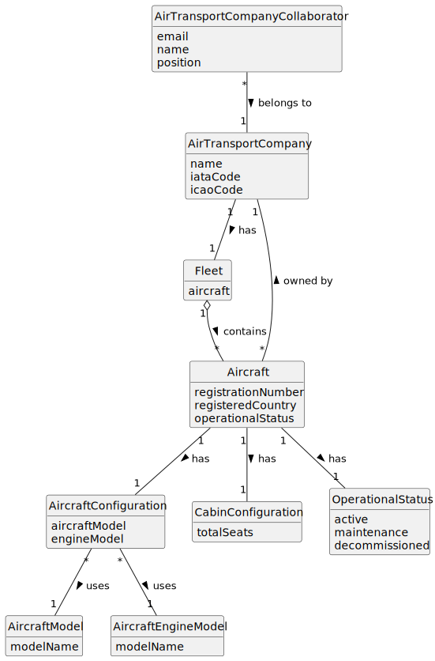

# US072 - List an Air Transport Company's Fleet

## 2. Analysis

### 2.1. Relevant Domain Concepts

The relevant domain concepts for this user story are:

* **Air Transport Company Collaborator:** user associated with an air transport company and allowed to consult company resources.
* **Air Transport Company:** company that owns the aircraft fleet.
* **Fleet:** set of aircraft belonging to an air transport company.
* **Aircraft:** actual aircraft registered in the company's fleet.
* **Aircraft Registration Number:** unique identifier of an aircraft.
* **Aircraft Model:** model of the aircraft.
* **Aircraft Configuration:** combination of aircraft model and engine model.
* **Cabin Configuration:** number of seats by class.
* **Registered Country:** country where the aircraft is registered.
* **Operational Status:** current operational state of the aircraft.

---

### 2.2. Business Rules

* Only an authorized Air Transport Company Collaborator can list their company's fleet.
* The collaborator must belong to the selected company.
* The selected air transport company must exist.
* The fleet listing must include all aircraft belonging to the company.
* Decommissioned aircraft must remain in the fleet.
* The list must include each aircraft's operational status.
* The listing operation must not modify aircraft or company data.
* If the company has no aircraft, the system must return an empty list or appropriate message.

---

### 2.3. Preconditions

* The Air Transport Company Collaborator must be authenticated.
* The collaborator must be authorized to list the company fleet.
* The collaborator must belong to the selected company.
* The selected air transport company must exist.

---

### 2.4. Postconditions

**Successful listing with aircraft:**

* The system displays the company's fleet.
* Aircraft data remains unchanged.
* Company data remains unchanged.

**Successful listing without aircraft:**

* The system displays an empty fleet message.
* System state remains unchanged.

**Failed listing:**

* No fleet data is displayed.
* System state remains unchanged.
* An error message is displayed.

---

### 2.5. Domain Model

