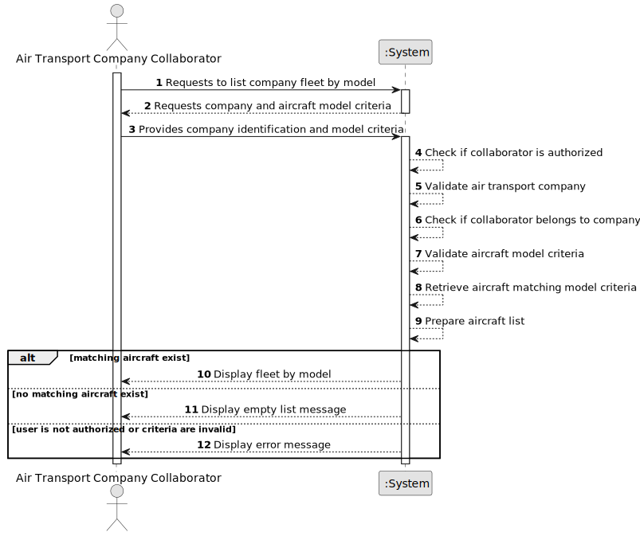

# US072a - List Fleet by Model

## 1. Requirements Engineering

### 1.1. User Story Description

As an Air Transport Company Collaborator, I want to list my company's fleet by aircraft model.

This functionality allows an authorized Air Transport Company Collaborator to consult aircraft belonging to their company's fleet according to aircraft model. The system may either group aircraft by model or allow the collaborator to select a specific model and list only aircraft of that model.

---

### 1.2. Customer Specifications and Clarifications

**From the specifications document:**

* An Air Transport Company Collaborator can list the company's fleet.
* Fleet listing may be performed by model.
* An aircraft belongs to an air transport company's fleet.
* An aircraft is of a given aircraft model.
* An aircraft has a registration number, engine configuration, cabin configuration, registered country and operational status.
* Authentication and authorization must be enforced for all users and functionalities.

**From the client clarifications:**

No additional client clarifications are currently available.

---

### 1.3. Acceptance Criteria

* **AC1:** An Air Transport Company Collaborator must be able to list their company's fleet by aircraft model.
* **AC2:** The collaborator must belong to the selected air transport company.
* **AC3:** The selected air transport company must exist.
* **AC4:** The system must list aircraft according to aircraft model.
* **AC5:** If a specific aircraft model is selected, only aircraft of that model must be listed.
* **AC6:** If no aircraft exists for the selected model, the system must display an appropriate empty list message.
* **AC7:** The list must include aircraft registration number.
* **AC8:** The list must include aircraft model.
* **AC9:** The list must include engine configuration.
* **AC10:** The list must include cabin configuration or total seat capacity.
* **AC11:** The list must include registered country.
* **AC12:** The list must include operational status.
* **AC13:** Decommissioned aircraft should remain visible unless a future rule explicitly excludes them.
* **AC14:** Only an authenticated and authorized Air Transport Company Collaborator can list the fleet by model.
* **AC15:** The listing operation must not modify fleet or aircraft data.

---

### 1.4. Found out Dependencies

* This user story depends on US030, because authentication and authorization must be enforced.
* This user story depends on US060, because the air transport company must exist.
* This user story depends on US061, because the actor must be a collaborator of the company.
* This user story depends on US070, because aircraft must be registered before they can be listed.
* This user story depends on US072, because it is a specialized version of the base fleet listing.
* This user story depends on US055, because aircraft models must exist.
* This user story is related to US071, because decommissioned aircraft remain in the fleet and should appear with their operational status.

---

### 1.5. Input and Output Data

**Input Data:**

* Selected data:
    * Air transport company
    * Aircraft model, if filtering by a specific model

**Output Data:**

* In case aircraft exist:
    * List of aircraft grouped or filtered by aircraft model, including:
        * Registration number
        * Aircraft model
        * Engine configuration
        * Cabin configuration or total seats
        * Registered country
        * Operational status

* In case no aircraft exist:
    * Empty list message

* In case of failure:
    * Error message explaining why the fleet could not be listed by model

---

### 1.6. System Sequence Diagram

**_Other alternatives might exist._**

---

### 1.7. Other Relevant Remarks

* This is a read-only user story.
* This user story should reuse the same access rules as US072.
* The first implementation may support filtering by a selected aircraft model.
* A later implementation may also support grouped output by all aircraft models.
* Listing the fleet by model must not modify aircraft or company data.