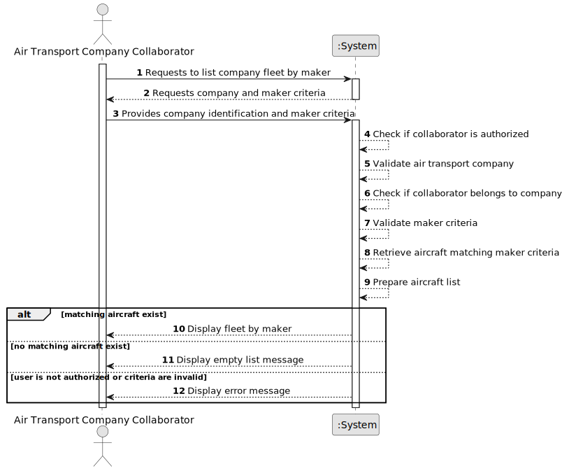

# US072b - List Fleet by Maker

## 1. Requirements Engineering

### 1.1. User Story Description

As an Air Transport Company Collaborator, I want to list my company's fleet by aircraft maker.

This functionality allows an authorized Air Transport Company Collaborator to consult aircraft belonging to their company's fleet according to the aircraft model's maker/manufacturer. The system may either group aircraft by maker or allow the collaborator to select a specific maker and list only aircraft made by that maker.

---

### 1.2. Customer Specifications and Clarifications

**From the specifications document:**

* An Air Transport Company Collaborator can list the company's fleet.
* Fleet listing may be performed by maker.
* An aircraft belongs to an air transport company's fleet.
* An aircraft is of a given aircraft model.
* An aircraft model has a maker/manufacturer.
* An aircraft has a registration number, engine configuration, cabin configuration, registered country and operational status.
* Authentication and authorization must be enforced for all users and functionalities.

**From the client clarifications:**

No additional client clarifications are currently available.

---

### 1.3. Acceptance Criteria

* **AC1:** An Air Transport Company Collaborator must be able to list their company's fleet by aircraft maker.
* **AC2:** The collaborator must belong to the selected air transport company.
* **AC3:** The selected air transport company must exist.
* **AC4:** The system must list aircraft according to aircraft maker/manufacturer.
* **AC5:** If a specific maker is selected, only aircraft whose model belongs to that maker must be listed.
* **AC6:** If no aircraft exists for the selected maker, the system must display an appropriate empty list message.
* **AC7:** The list must include aircraft registration number.
* **AC8:** The list must include aircraft maker/manufacturer.
* **AC9:** The list must include aircraft model.
* **AC10:** The list must include engine configuration.
* **AC11:** The list must include cabin configuration or total seat capacity.
* **AC12:** The list must include registered country.
* **AC13:** The list must include operational status.
* **AC14:** Decommissioned aircraft should remain visible unless a future rule explicitly excludes them.
* **AC15:** Only an authenticated and authorized Air Transport Company Collaborator can list the fleet by maker.
* **AC16:** The listing operation must not modify fleet or aircraft data.

---

### 1.4. Found out Dependencies

* This user story depends on US030, because authentication and authorization must be enforced.
* This user story depends on US060, because the air transport company must exist.
* This user story depends on US061, because the actor must be a collaborator of the company.
* This user story depends on US070, because aircraft must be registered before they can be listed.
* This user story depends on US072, because it is a specialized version of the base fleet listing.
* This user story depends on US055, because aircraft models have makers/manufacturers.
* This user story is related to US071, because decommissioned aircraft remain in the fleet and should appear with their operational status.

---

### 1.5. Input and Output Data

**Input Data:**

* Selected data:
    * Air transport company
    * Aircraft maker/manufacturer, if filtering by a specific maker

**Output Data:**

* In case aircraft exist:
    * List of aircraft grouped or filtered by maker, including:
        * Registration number
        * Maker/manufacturer
        * Aircraft model
        * Engine configuration
        * Cabin configuration or total seats
        * Registered country
        * Operational status

* In case no aircraft exist:
    * Empty list message

* In case of failure:
    * Error message explaining why the fleet could not be listed by maker

---

### 1.6. System Sequence Diagram

**_Other alternatives might exist._**

---

### 1.7. Other Relevant Remarks

* This is a read-only user story.
* This user story should reuse the same access rules as US072.
* The first implementation may support filtering by a selected aircraft maker.
* A later implementation may also support grouped output by all aircraft makers.
* Listing the fleet by maker must not modify aircraft or company data.