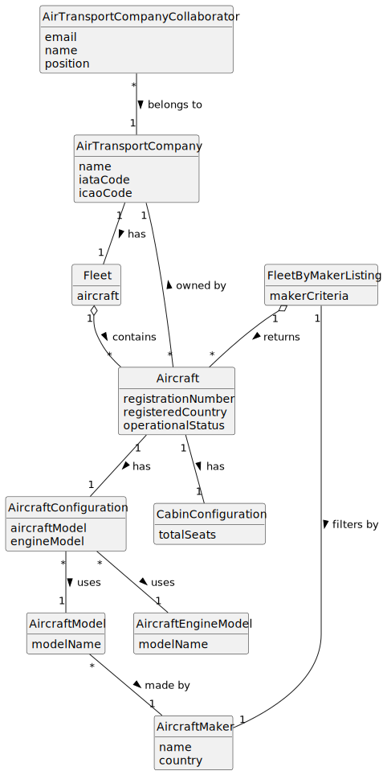

# US072b - List Fleet by Maker

## 2. Analysis

### 2.1. Relevant Domain Concepts

The relevant domain concepts for this user story are:

* **Air Transport Company Collaborator:** user associated with an air transport company and allowed to consult company fleet data.
* **Air Transport Company:** company that owns the aircraft fleet.
* **Fleet:** set of aircraft belonging to an air transport company.
* **Aircraft:** actual aircraft registered in the company's fleet.
* **Aircraft Model:** model used by the aircraft.
* **Aircraft Maker/Manufacturer:** maker of the aircraft model.
* **Aircraft Configuration:** combination of aircraft model and engine model.
* **Cabin Configuration:** number of seats by class.
* **Operational Status:** current operational state of the aircraft.
* **Fleet by Maker Listing:** list of aircraft filtered or grouped by aircraft maker.

---

### 2.2. Business Rules

* Only an authorized Air Transport Company Collaborator can list their company's fleet by maker.
* The collaborator must belong to the selected company.
* The selected air transport company must exist.
* The selected maker must exist if a specific maker is used as filter.
* Only aircraft belonging to the selected company may be listed.
* If filtering by maker, only aircraft whose aircraft model belongs to that maker must be listed.
* Decommissioned aircraft should remain visible with their operational status.
* The listing operation must not modify aircraft or company data.
* If no aircraft match the maker criteria, the system must return an empty list or appropriate message.

---

### 2.3. Preconditions

* The Air Transport Company Collaborator must be authenticated.
* The collaborator must be authorized to list the company fleet.
* The collaborator must belong to the selected company.
* The selected company must exist.
* The selected maker must exist, if filtering by maker.

---

### 2.4. Postconditions

**Successful listing with matching aircraft:**

* The system displays aircraft matching the maker criteria.
* Aircraft data remains unchanged.
* Company data remains unchanged.

**Successful listing without matching aircraft:**

* The system displays an empty list message.
* System state remains unchanged.

**Failed listing:**

* No fleet data is displayed.
* System state remains unchanged.
* An error message is displayed.

---

### 2.5. Domain Model

