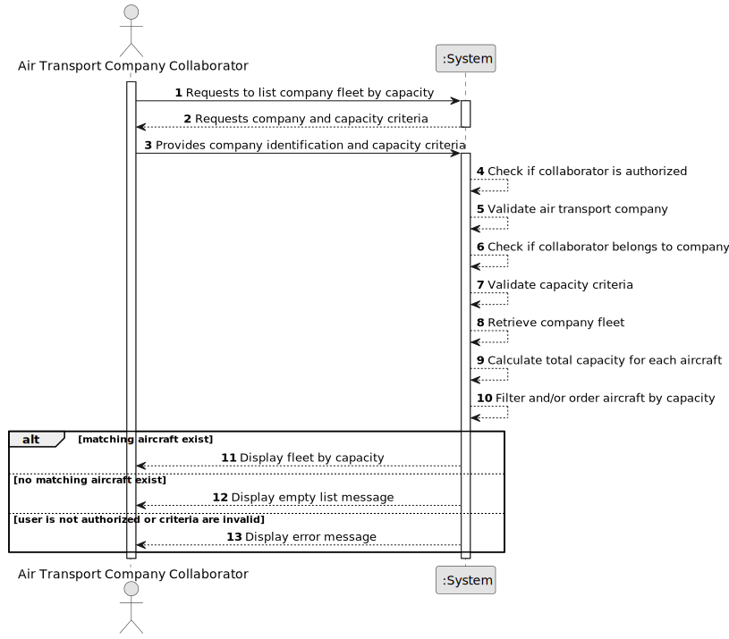

# US072c - List Fleet by Capacity

## 1. Requirements Engineering

### 1.1. User Story Description

As an Air Transport Company Collaborator, I want to list my company's fleet by aircraft capacity.

This functionality allows an authorized Air Transport Company Collaborator to consult aircraft belonging to their company's fleet according to capacity. Capacity is determined by the aircraft's cabin configuration, namely the total number of seats across all classes.

---

### 1.2. Customer Specifications and Clarifications

**From the specifications document:**

* An Air Transport Company Collaborator can list the company's fleet.
* Fleet listing may be performed by capacity.
* An aircraft belongs to an air transport company's fleet.
* An aircraft has a cabin configuration.
* The number of seats of each type/class is provided when the aircraft is added.
* The total number of seats cannot exceed the aircraft model's capacity.
* An aircraft has a registration number, model, engine configuration, registered country and operational status.
* Authentication and authorization must be enforced for all users and functionalities.

**From the client clarifications:**

No additional client clarifications are currently available.

---

### 1.3. Acceptance Criteria

* **AC1:** An Air Transport Company Collaborator must be able to list their company's fleet by aircraft capacity.
* **AC2:** The collaborator must belong to the selected air transport company.
* **AC3:** The selected air transport company must exist.
* **AC4:** The system must calculate aircraft capacity from the cabin configuration.
* **AC5:** The system must list aircraft according to total seat capacity.
* **AC6:** The system should support ordering by capacity in ascending or descending order.
* **AC7:** If a capacity interval is provided, only aircraft within that interval must be listed.
* **AC8:** If no aircraft match the capacity criteria, the system must display an appropriate empty list message.
* **AC9:** The list must include aircraft registration number.
* **AC10:** The list must include aircraft model.
* **AC11:** The list must include engine configuration.
* **AC12:** The list must include total seat capacity.
* **AC13:** The list must include registered country.
* **AC14:** The list must include operational status.
* **AC15:** Decommissioned aircraft should remain visible unless a future rule explicitly excludes them.
* **AC16:** Only an authenticated and authorized Air Transport Company Collaborator can list the fleet by capacity.
* **AC17:** The listing operation must not modify fleet or aircraft data.

---

### 1.4. Found out Dependencies

* This user story depends on US030, because authentication and authorization must be enforced.
* This user story depends on US060, because the air transport company must exist.
* This user story depends on US061, because the actor must be a collaborator of the company.
* This user story depends on US070, because aircraft must be registered with cabin configuration before they can be listed by capacity.
* This user story depends on US072, because it is a specialized version of the base fleet listing.
* This user story is related to US071, because decommissioned aircraft remain in the fleet and should appear with their operational status.

---

### 1.5. Input and Output Data

**Input Data:**

* Selected data:
    * Air transport company

* Optional typed/selected data:
    * Minimum capacity
    * Maximum capacity
    * Sorting order:
        * Ascending capacity
        * Descending capacity

**Output Data:**

* In case aircraft exist:
    * List of aircraft ordered or filtered by capacity, including:
        * Registration number
        * Aircraft model
        * Engine configuration
        * Total seat capacity
        * Registered country
        * Operational status

* In case no aircraft exist:
    * Empty list message

* In case of failure:
    * Error message explaining why the fleet could not be listed by capacity

---

### 1.6. System Sequence Diagram

**_Other alternatives might exist._**

---

### 1.7. Other Relevant Remarks

* This is a read-only user story.
* This user story should reuse the same access rules as US072.
* Capacity should be derived from cabin configuration, not typed manually in this listing use case.
* The first implementation may support simple sorting by total capacity.
* A later implementation may support filtering by minimum and maximum capacity.
* Listing the fleet by capacity must not modify aircraft or company data.