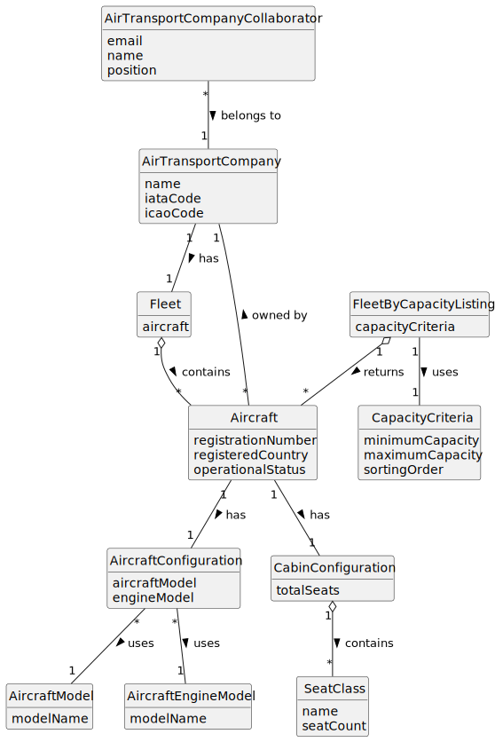

# US072c - List Fleet by Capacity

## 2. Analysis

### 2.1. Relevant Domain Concepts

The relevant domain concepts for this user story are:

* **Air Transport Company Collaborator:** user associated with an air transport company and allowed to consult company fleet data.
* **Air Transport Company:** company that owns the aircraft fleet.
* **Fleet:** set of aircraft belonging to an air transport company.
* **Aircraft:** actual aircraft registered in the company's fleet.
* **Cabin Configuration:** number of seats by class.
* **Aircraft Capacity:** total number of seats calculated from the cabin configuration.
* **Aircraft Model:** model used by the aircraft.
* **Aircraft Configuration:** combination of aircraft model and engine model.
* **Operational Status:** current operational state of the aircraft.
* **Fleet by Capacity Listing:** list of aircraft filtered or ordered by total capacity.

---

### 2.2. Business Rules

* Only an authorized Air Transport Company Collaborator can list their company's fleet by capacity.
* The collaborator must belong to the selected company.
* The selected air transport company must exist.
* Only aircraft belonging to the selected company may be listed.
* Aircraft capacity must be calculated from cabin configuration.
* If sorting is requested, aircraft must be ordered by total capacity.
* If a capacity interval is provided, only aircraft within that interval must be listed.
* Capacity criteria must be valid.
* Decommissioned aircraft should remain visible with their operational status.
* The listing operation must not modify aircraft or company data.
* If no aircraft match the capacity criteria, the system must return an empty list or appropriate message.

---

### 2.3. Preconditions

* The Air Transport Company Collaborator must be authenticated.
* The collaborator must be authorized to list the company fleet.
* The collaborator must belong to the selected company.
* The selected company must exist.
* Capacity criteria, if provided, must be valid.

---

### 2.4. Postconditions

**Successful listing with matching aircraft:**

* The system displays aircraft matching the capacity criteria.
* Aircraft are ordered by capacity if a sorting order was provided.
* Aircraft data remains unchanged.
* Company data remains unchanged.

**Successful listing without matching aircraft:**

* The system displays an empty list message.
* System state remains unchanged.

**Failed listing:**

* No fleet data is displayed.
* System state remains unchanged.
* An error message is displayed.

---

### 2.5. Domain Model

