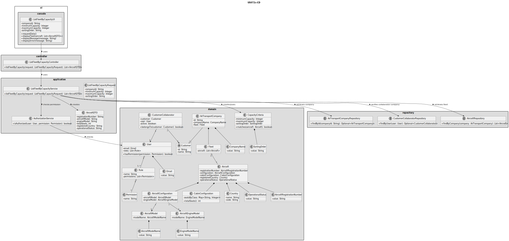
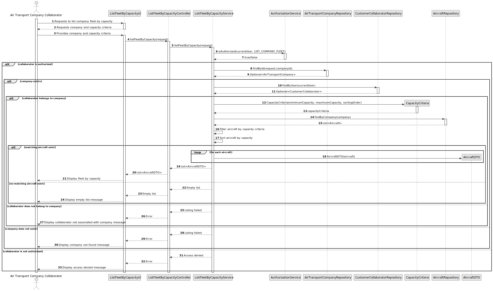

# US072c - List Fleet by Capacity

## 3. Design

### 3.1. Responsibility Assignment

The fleet by capacity listing process is divided between the following components:

* **ListFleetByCapacityUI:** interacts with the Air Transport Company Collaborator and collects the selected company and capacity criteria.
* **ListFleetByCapacityController:** receives the list request from the UI.
* **ListFleetByCapacityService:** coordinates authorization, company validation, collaborator validation, criteria validation and fleet retrieval.
* **AuthorizationService:** verifies if the current user has permission to list the company fleet.
* **AirTransportCompanyRepository:** retrieves the selected company.
* **CustomerCollaboratorRepository:** verifies that the current user belongs to the selected company.
* **AircraftRepository:** retrieves the aircraft belonging to the company and matching the capacity criteria.
* **CapacityCriteria:** represents optional filtering and ordering information.
* **AircraftDTO:** transports aircraft information to the UI.
* **CabinConfiguration:** provides the total aircraft capacity.

---

### 3.2. Class Diagram

---

### 3.3. Sequence Diagram

---

### 3.4. Applied Patterns

* **UI:** responsible for collecting input and displaying fleet data.
* **Controller:** receives and delegates the request.
* **Service:** coordinates authorization and data retrieval.
* **Repository:** abstracts company, collaborator and aircraft lookup.
* **DTO:** transfers aircraft data to the UI.
* **Read-only Query:** retrieves data without modifying domain state.
* **Query Criteria:** capacity criteria defines filtering and ordering rules.

---

### 3.5. Design Remarks

* The UI must not access repositories directly.
* The Controller should not contain business rules.
* The Service should coordinate authorization, validation and retrieval.
* The collaborator must belong to the company whose fleet is being listed.
* Capacity should be calculated from `CabinConfiguration.totalSeats()`.
* This user story should reuse the same output structure as US072 when possible.
* The operation must be read-only.