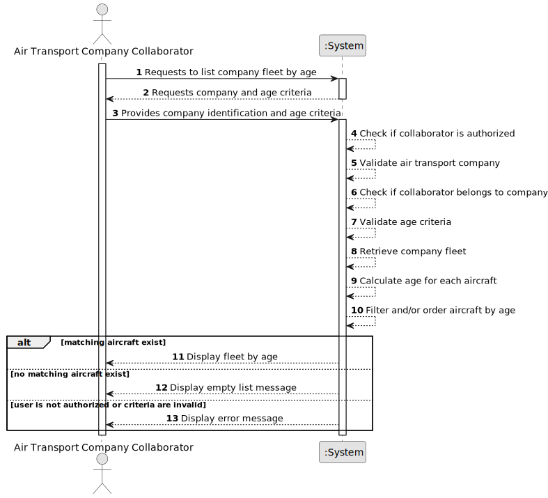

# US072d - List Fleet by Age

## 1. Requirements Engineering

### 1.1. User Story Description

As an Air Transport Company Collaborator, I want to list my company's fleet by aircraft age.

This functionality allows an authorized Air Transport Company Collaborator to consult aircraft belonging to their company's fleet according to aircraft age. Age should be calculated from a date associated with the aircraft, such as manufacture date, registration date or entry into service date.

---

### 1.2. Customer Specifications and Clarifications

**From the specifications document:**

* An Air Transport Company Collaborator can list the company's fleet.
* Fleet listing may be performed by age.
* An aircraft belongs to an air transport company's fleet.
* An aircraft has a registration number, model, engine configuration, cabin configuration, registered country and operational status.
* An aircraft is not removed from the fleet when decommissioned.
* Authentication and authorization must be enforced for all users and functionalities.

**From the client clarifications:**

No additional client clarifications are currently available.

---

### 1.3. Acceptance Criteria

* **AC1:** An Air Transport Company Collaborator must be able to list their company's fleet by aircraft age.
* **AC2:** The collaborator must belong to the selected air transport company.
* **AC3:** The selected air transport company must exist.
* **AC4:** The system must calculate aircraft age from the aircraft's reference date.
* **AC5:** The aircraft reference date must be available for age calculation.
* **AC6:** The system must list aircraft according to age.
* **AC7:** The system should support ordering by age in ascending or descending order.
* **AC8:** If an age interval is provided, only aircraft within that interval must be listed.
* **AC9:** If no aircraft match the age criteria, the system must display an appropriate empty list message.
* **AC10:** The list must include aircraft registration number.
* **AC11:** The list must include aircraft model.
* **AC12:** The list must include aircraft age.
* **AC13:** The list must include engine configuration.
* **AC14:** The list must include cabin configuration or total seat capacity.
* **AC15:** The list must include registered country.
* **AC16:** The list must include operational status.
* **AC17:** Decommissioned aircraft should remain visible unless a future rule explicitly excludes them.
* **AC18:** Only an authenticated and authorized Air Transport Company Collaborator can list the fleet by age.
* **AC19:** The listing operation must not modify fleet or aircraft data.

---

### 1.4. Found out Dependencies

* This user story depends on US030, because authentication and authorization must be enforced.
* This user story depends on US060, because the air transport company must exist.
* This user story depends on US061, because the actor must be a collaborator of the company.
* This user story depends on US070, because aircraft must be registered before they can be listed by age.
* This user story depends on US072, because it is a specialized version of the base fleet listing.
* This user story is related to US071, because decommissioned aircraft remain in the fleet and should appear with their operational status.
* This user story may require the Aircraft entity to store a reference date, such as manufacture date, registration date or entry into service date.

---

### 1.5. Input and Output Data

**Input Data:**

* Selected data:
    * Air transport company

* Optional typed/selected data:
    * Minimum age
    * Maximum age
    * Sorting order:
        * Ascending age
        * Descending age

**Output Data:**

* In case aircraft exist:
    * List of aircraft ordered or filtered by age, including:
        * Registration number
        * Aircraft model
        * Aircraft age
        * Engine configuration
        * Cabin configuration or total seats
        * Registered country
        * Operational status

* In case no aircraft exist:
    * Empty list message

* In case of failure:
    * Error message explaining why the fleet could not be listed by age

---

### 1.6. System Sequence Diagram

**_Other alternatives might exist._**

---

### 1.7. Other Relevant Remarks

* This is a read-only user story.
* This user story should reuse the same access rules as US072.
* Age should be calculated from an aircraft reference date instead of being manually stored as a mutable value.
* The exact reference date used for age calculation should be clarified or decided during implementation.
* The first implementation may support simple sorting by age.
* A later implementation may support filtering by minimum and maximum age.
* Listing the fleet by age must not modify aircraft or company data.