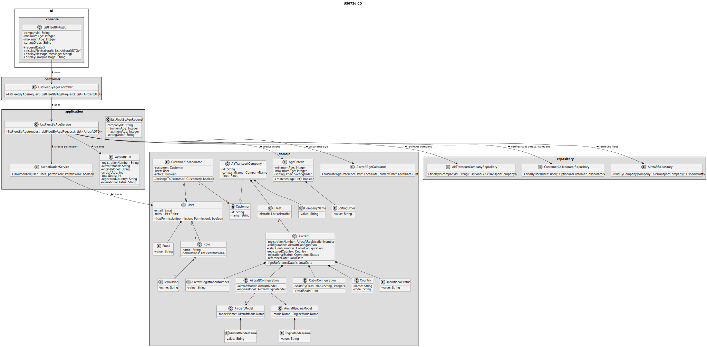
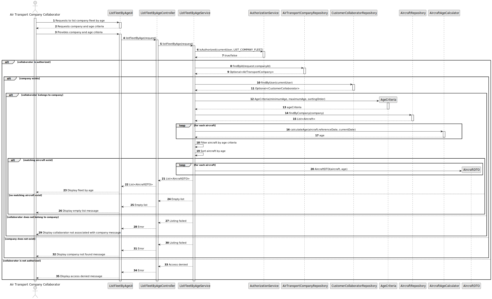

# US072d - List Fleet by Age

## 3. Design

### 3.1. Responsibility Assignment

The fleet by age listing process is divided between the following components:

* **ListFleetByAgeUI:** interacts with the Air Transport Company Collaborator and collects the selected company and age criteria.
* **ListFleetByAgeController:** receives the list request from the UI.
* **ListFleetByAgeService:** coordinates authorization, company validation, collaborator validation, criteria validation and fleet retrieval.
* **AuthorizationService:** verifies if the current user has permission to list the company fleet.
* **AirTransportCompanyRepository:** retrieves the selected company.
* **CustomerCollaboratorRepository:** verifies that the current user belongs to the selected company.
* **AircraftRepository:** retrieves the aircraft belonging to the company.
* **AgeCriteria:** represents optional filtering and ordering information.
* **AircraftAgeCalculator:** calculates aircraft age from the aircraft reference date.
* **AircraftDTO:** transports aircraft information to the UI.
* **Aircraft:** domain entity representing an aircraft in the fleet.

---

### 3.2. Class Diagram

---

### 3.3. Sequence Diagram

---

### 3.4. Applied Patterns

* **UI:** responsible for collecting input and displaying fleet data.
* **Controller:** receives and delegates the request.
* **Service:** coordinates authorization and data retrieval.
* **Repository:** abstracts company, collaborator and aircraft lookup.
* **DTO:** transfers aircraft data to the UI.
* **Read-only Query:** retrieves data without modifying domain state.
* **Query Criteria:** age criteria defines filtering and ordering rules.
* **Domain Service:** age calculation is isolated in `AircraftAgeCalculator`.

---

### 3.5. Design Remarks

* The UI must not access repositories directly.
* The Controller should not contain business rules.
* The Service should coordinate authorization, validation and retrieval.
* The collaborator must belong to the company whose fleet is being listed.
* Aircraft age should be calculated dynamically from a reference date.
* The reference date must not be changed by this operation.
* This user story should reuse the same output structure as US072 when possible.
* The operation must be read-only.