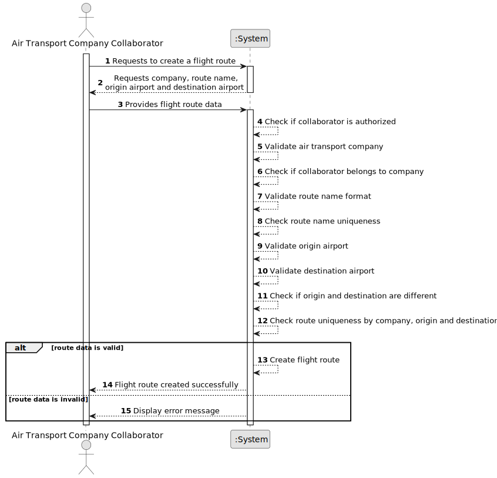

# US073 - Create a Flight Route

## 1. Requirements Engineering

### 1.1. User Story Description

As an Air Transport Company Collaborator, I want to create a flight route for my company.

This functionality allows an authorized Air Transport Company Collaborator to create a flight route operated by their company. A route connects an origin airport to a destination airport and may later be used when creating flight plans.
The flight route must have a unique route name composed of the company's two-letter initials followed by up to four digits, such as TP123.
---

### 1.2. Customer Specifications and Clarifications

**From the specifications document:**

* Air transport companies use the system to register aircraft and flights.
* An Air Transport Company Collaborator can create flight routes for their company.
* A route connects airports.
* Airports are registered in the system.
* A flight route belongs to an air transport company.
* Flight plans are created based on existing routes.
* Authentication and authorization must be enforced for all users and functionalities.
* A flight route has a route name.
* The route name must start with the company's two-letter initials.
* The route name may include up to four digits after the company initials.
* The route name must be unique.

**From the client clarifications:**

No additional client clarifications are currently available.

---

### 1.3. Acceptance Criteria

* **AC1:** An Air Transport Company Collaborator must be able to create a flight route for their company.
* **AC2:** The collaborator must belong to the selected air transport company.
* **AC3:** The selected air transport company must exist.
* **AC4:** The origin airport must exist in the system.
* **AC5:** The destination airport must exist in the system.
* **AC6:** The origin airport and destination airport must be different.
* **AC7:** The route must be associated with exactly one air transport company.
* **AC8:** The route must have a route name.
* **AC9:** The route name must start with the company's two-letter initials.
* **AC10:** The route name may include up to four digits after the company initials.
* **AC11:** The route name must be unique.
* **AC12:** The system must not create a duplicated route for the same company, origin and destination, unless future rules allow multiple variants.
* **AC13:** The route must be stored after successful creation.
* **AC14:** Only an authenticated and authorized Air Transport Company Collaborator can create routes.
* **AC15:** The system must display a success message when the route is created successfully.
* **AC16:** The system must display an error message when route creation fails.
---

### 1.4. Found out Dependencies

* This user story depends on US030, because authentication and authorization must be enforced.
* This user story depends on US052, because origin and destination airports must exist.
* This user story depends on US060, because the air transport company must exist.
* This user story depends on US061, because the actor must be a collaborator of the company.
* This user story is related to US080, because flight plans are created for existing flight routes.
* This user story is related to later route listing or route management user stories.

---

### 1.5. Input and Output Data

**Input Data:**

* Selected data:
    * Air transport company
    * Origin airport
    * Destination airport

* Typed data:
  * Route name
  * Optional route description

**Output Data:**

* In case of success:
    * Success message
    * Created flight route information

* In case of failure:
    * Error message explaining why the flight route could not be created

---

### 1.6. System Sequence Diagram

**_Other alternatives might exist._**

---

### 1.7. Other Relevant Remarks

* The origin and destination airports must be different.
* The route belongs to an air transport company.
* A route should not be created by a collaborator from another company.
* The route may later be used to create flight plans.
* The route name should follow the format formed by the company's two-letter initials followed by up to four digits, such as TP123.