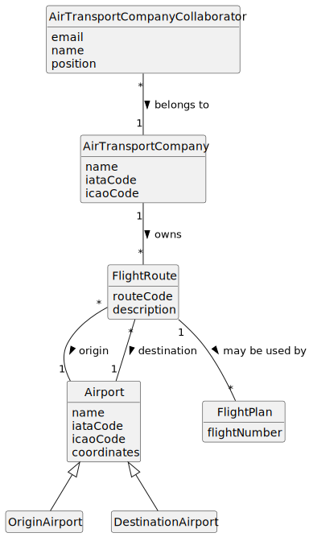

# US073 - Create a Flight Route

## 2. Analysis

### 2.1. Relevant Domain Concepts

The relevant domain concepts for this user story are:

* **Air Transport Company Collaborator:** user associated with an air transport company and allowed to manage company routes.
* **Air Transport Company:** company that owns and operates flight routes.
* **Flight Route:** connection between an origin airport and a destination airport.
* **Origin Airport:** airport where the route starts.
* **Destination Airport:** airport where the route ends.
* **Airport:** registered airport in the system.
* **Route Code:** identifier of the route within the company.
* **Flight Plan:** future operational plan created based on a flight route.

---

### 2.2. Business Rules

* Only an authorized Air Transport Company Collaborator can create flight routes.
* The collaborator must belong to the selected company.
* The selected air transport company must exist.
* The origin airport must exist.
* The destination airport must exist.
* The origin airport and destination airport must be different.
* A flight route must belong to exactly one air transport company.
* A duplicated route should not be created for the same company, origin and destination.
* The route must be stored after successful creation.
* If route creation fails, the system state must remain unchanged.

---

### 2.3. Preconditions

* The Air Transport Company Collaborator must be authenticated.
* The collaborator must be authorized to create flight routes.
* The collaborator must belong to the selected company.
* The selected company must exist.
* The origin airport must exist.
* The destination airport must exist.

---

### 2.4. Postconditions

**Successful route creation:**

* A new flight route is created.
* The route is associated with the selected air transport company.
* The route connects the selected origin airport to the selected destination airport.
* The route can later be used to create flight plans.

**Failed route creation:**

* No route is created.
* The company route list remains unchanged.
* An error message is displayed.

---

### 2.5. Domain Model

