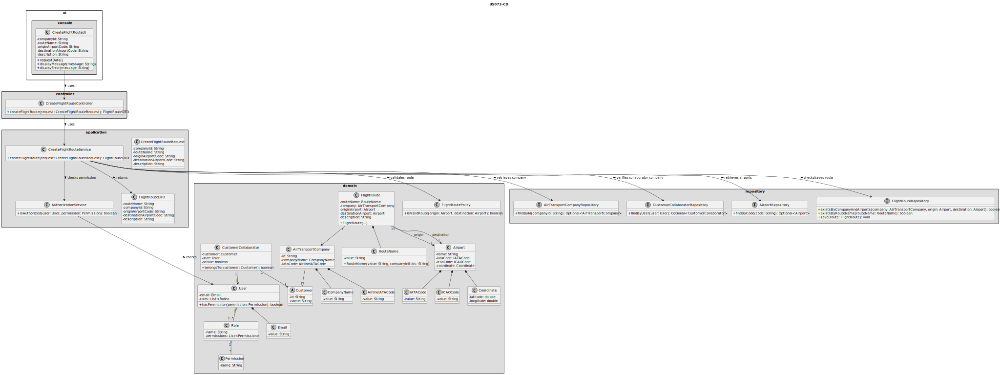
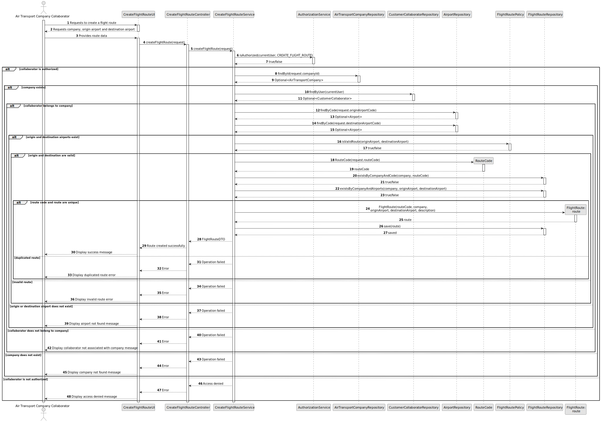

# US073 - Create a Flight Route

## 3. Design

### 3.1. Responsibility Assignment

The flight route creation process is divided between the following components:

* **CreateFlightRouteUI:** interacts with the Air Transport Company Collaborator and collects route data.
* **CreateFlightRouteController:** receives the request from the UI.
* **CreateFlightRouteService:** coordinates authorization, company validation, collaborator validation, airport lookup, route validation and persistence.
* **AuthorizationService:** verifies if the current user has permission to create flight routes.
* **AirTransportCompanyRepository:** retrieves the selected company.
* **CustomerCollaboratorRepository:** verifies that the current user belongs to the selected company.
* **AirportRepository:** retrieves origin and destination airports.
* **FlightRouteRepository:** checks route uniqueness and stores the new route.
* **FlightRoute:** domain entity representing the route.
* **RouteName:** value object representing the route name and validating the required format.
* **FlightRoutePolicy:** domain policy responsible for validating route-specific rules.

---

### 3.2. Class Diagram

---

### 3.3. Sequence Diagram

---

### 3.4. Applied Patterns

* **UI:** responsible for collecting input from the Air Transport Company Collaborator.
* **Controller:** receives and delegates the request.
* **Service:** coordinates the use case.
* **Repository:** abstracts lookup and persistence.
* **Entity:** represents flight routes, companies and airports.
* **Value Object:** represents route name.
* **Domain Policy:** centralizes route creation rules.
* **DTO:** transfers created route data to the UI.

---

### 3.5. Design Remarks

* The UI must not access repositories directly.
* The Controller should not contain business rules.
* The Service should coordinate authorization, lookup, validation and persistence.
* The collaborator must belong to the company that will own the route.
* Origin and destination airports must be different.
* Route uniqueness should be verified at repository or service level.
* The route should be reusable by flight plan creation.
* The route name should be validated by a `RouteName` value object.
* The route name must follow the company's two-letter initials plus up to four digits.