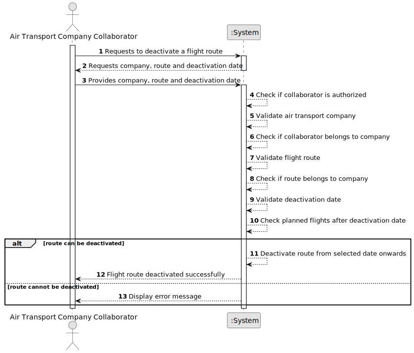

# US074 - Delete a Flight Route

## 1. Requirements Engineering

### 1.1. User Story Description

As an Air Transport Company Collaborator, I want to deactivate a flight route from a given date onwards.

This functionality allows an authorized Air Transport Company Collaborator to deactivate an existing flight route belonging to their company. The route is not physically removed from the system. Instead, it becomes unavailable for creating new flights from a given date onwards.

A route cannot be deactivated if there are planned flights after the selected deactivation date.

---

### 1.2. Customer Specifications and Clarifications

**From the specifications document:**

* An Air Transport Company Collaborator can deactivate a flight route from a given date onwards.
* No more flights can be created on a deleted flight route.
* A route cannot be deleted if there are planned flights after that date.
* A flight route belongs to an air transport company.
* Authentication and authorization must be enforced for all users and functionalities.

**From the client clarifications:**

No additional client clarifications are currently available.

---

### 1.3. Acceptance Criteria

* **AC1:** An Air Transport Company Collaborator must be able to deactivate a flight route from a given date onwards.
* **AC2:** The collaborator must belong to the company that owns the route.
* **AC3:** The selected air transport company must exist.
* **AC4:** The selected flight route must exist.
* **AC5:** The selected flight route must belong to the collaborator's company.
* **AC6:** The deactivation date must be provided.
* **AC7:** The system must check if there are planned flights after the deactivation date.
* **AC8:** The system must not deactivate the route if planned flights exist after the deactivation date.
* **AC9:** If the route is deactivated successfully, no new flights can be created for that route from that date onwards.
* **AC10:** Deactivating a route must not physically delete it from the system.
* **AC11:** Existing historical information about the route must be preserved.
* **AC12:** Only an authenticated and authorized Air Transport Company Collaborator can deactivate flight routes.
* **AC13:** The system must display a success message when the route is deactivated successfully.
* **AC14:** The system must display an error message when the operation fails.

---

### 1.4. Found out Dependencies

* This user story depends on US030, because authentication and authorization must be enforced.
* This user story depends on US060, because the air transport company must exist.
* This user story depends on US061, because the actor must be a collaborator of the company.
* This user story depends on US073, because a route must exist before it can be deactivated.
* This user story is related to US080, because no new flight plans should be created on a route deactivated from the relevant date onwards.
* This user story is related to future flight listing or scheduling features, because planned flights must be checked.

---

### 1.5. Input and Output Data

**Input Data:**

* Selected data:
    * Air transport company
    * Flight route

* Typed data:
    * Deactivation date

**Output Data:**

* In case of success:
    * Success message
    * Updated flight route status
    * Deactivation date

* In case of failure:
    * Error message explaining why the flight route could not be deactivated

---

### 1.6. System Sequence Diagram

**_Other alternatives might exist._**

---

### 1.7. Other Relevant Remarks

* Although the user story says "delete", the intended operation is a logical deactivation from a given date onwards.
* The route should remain stored in the system for historical and audit purposes.
* The route should not be available for creating new flights after the deactivation date.
* Planned flights after the selected date block the operation.