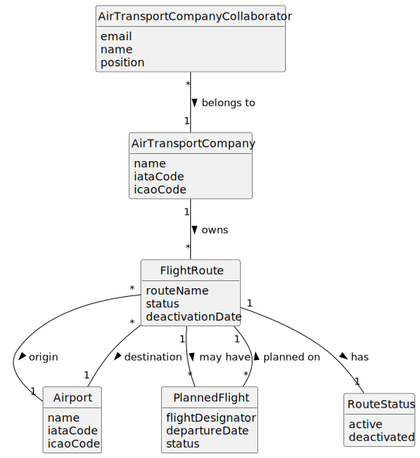

# US074 - Delete a Flight Route

## 2. Analysis

### 2.1. Relevant Domain Concepts

The relevant domain concepts for this user story are:

* **Air Transport Company Collaborator:** user associated with an air transport company and allowed to manage company routes.
* **Air Transport Company:** company that owns and operates flight routes.
* **Flight Route:** connection between an origin airport and a destination airport.
* **Route Status:** indicates whether the route is active or deactivated.
* **Deactivation Date:** date from which the route can no longer be used to create new flights.
* **Planned Flight:** future flight or flight plan associated with the route.
* **Route Deactivation:** logical deletion of a route from a given date onwards.

---

### 2.2. Business Rules

* Only an authorized Air Transport Company Collaborator can deactivate flight routes.
* The collaborator must belong to the company that owns the route.
* The selected air transport company must exist.
* The selected flight route must exist.
* The selected flight route must belong to the selected company.
* The deactivation date must be valid.
* A route cannot be deactivated if there are planned flights after the deactivation date.
* A deactivated route must not be used to create new flights from the deactivation date onwards.
* Deactivating a route must not physically remove it from the system.
* Historical route information must be preserved.
* If deactivation fails, the route must remain unchanged.

---

### 2.3. Preconditions

* The Air Transport Company Collaborator must be authenticated.
* The collaborator must be authorized to manage flight routes.
* The collaborator must belong to the selected company.
* The selected company must exist.
* The selected route must exist.
* The selected route must belong to the selected company.
* The deactivation date must be provided.

---

### 2.4. Postconditions

**Successful deactivation:**

* The route is marked as deactivated from the selected date onwards.
* The route remains stored in the system.
* No new flights can be created on the route from that date onwards.

**Failed deactivation:**

* The route remains unchanged.
* No deactivation date is applied.
* An error message is displayed.

---

### 2.5. Domain Model

