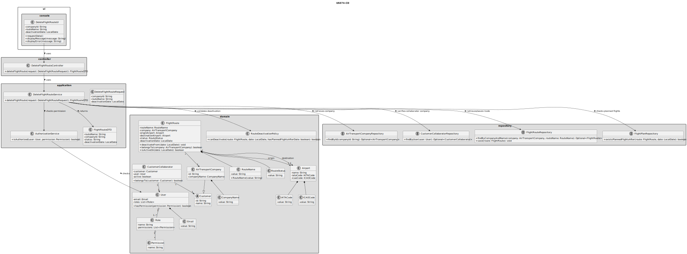
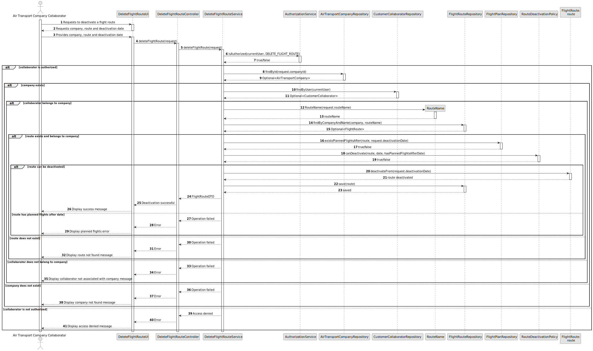

# US074 - Delete a Flight Route

## 3. Design

### 3.1. Responsibility Assignment

The flight route deactivation process is divided between the following components:

* **DeleteFlightRouteUI:** interacts with the Air Transport Company Collaborator and collects the selected route and deactivation date.
* **DeleteFlightRouteController:** receives the request from the UI.
* **DeleteFlightRouteService:** coordinates authorization, company validation, collaborator validation, route lookup, planned flight validation and route deactivation.
* **AuthorizationService:** verifies if the current user has permission to manage flight routes.
* **AirTransportCompanyRepository:** retrieves the selected company.
* **CustomerCollaboratorRepository:** verifies that the current user belongs to the selected company.
* **FlightRouteRepository:** retrieves and stores the flight route.
* **FlightPlanRepository:** checks whether planned flights exist after the deactivation date.
* **FlightRoute:** domain entity responsible for changing its own route status.
* **RouteDeactivationPolicy:** domain policy responsible for checking whether the route can be deactivated.

---

### 3.2. Class Diagram

---

### 3.3. Sequence Diagram

---

### 3.4. Applied Patterns

* **UI:** responsible for collecting input from the Air Transport Company Collaborator.
* **Controller:** receives and delegates the request.
* **Service:** coordinates the use case.
* **Repository:** abstracts lookup and persistence.
* **Entity:** represents flight routes and companies.
* **Domain Policy:** centralizes route deactivation rules.
* **State Change:** changes route status without physically deleting the route.
* **DTO:** transfers updated route data to the UI.

---

### 3.5. Design Remarks

* The UI must not access repositories directly.
* The Controller should not contain business rules.
* The Service should coordinate authorization, lookup, validation and persistence.
* The collaborator must belong to the company that owns the route.
* The route should expose a method such as `deactivateFrom(date)`.
* Planned flights after the deactivation date must be checked before deactivating the route.
* The route must remain stored in the system.