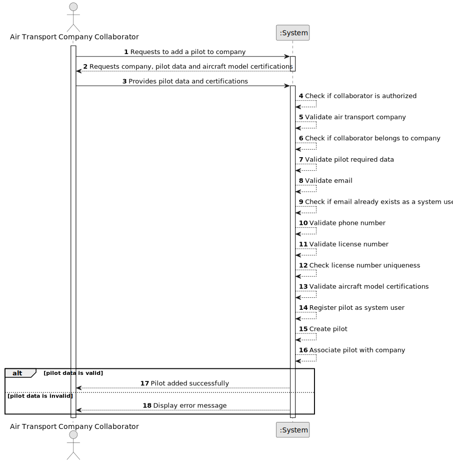

# US075 - Add a Pilot

## 1. Requirements Engineering

### 1.1. User Story Description

As an Air Transport Company Collaborator, I want to add a pilot to my company.

This functionality allows an authorized Air Transport Company Collaborator to add a pilot to their company. A pilot is also a system user, meaning that each pilot must correspond to a distinct user account. A pilot must be certified to pilot one or more aircraft models.

---

### 1.2. Customer Specifications and Clarifications

**From the specifications document:**

* An Air Transport Company Collaborator can add a pilot to their company.
* A pilot is a system's user.
* A pilot is certified to pilot one or more aircraft models.
* Aircraft models must be registered in the system.
* Air transport companies use the system to register aircraft and flights.
* Authentication and authorization must be enforced for all users and functionalities.

**From the client clarifications:**

No additional client clarifications are currently available.

---

### 1.3. Acceptance Criteria

* **AC1:** An Air Transport Company Collaborator must be able to add a pilot to their company.
* **AC2:** The collaborator must belong to the selected air transport company.
* **AC3:** The selected air transport company must exist.
* **AC4:** The pilot must be created as a system user.
* **AC5:** Each pilot must correspond to a distinct system user.
* **AC6:** The pilot must have a name.
* **AC7:** The pilot must have an email.
* **AC8:** The pilot email must be valid.
* **AC9:** The pilot email must be unique among system users.
* **AC10:** The pilot must have a phone number.
* **AC11:** The pilot must have a license number.
* **AC12:** The pilot license number must be unique.
* **AC13:** The pilot must be certified to pilot one or more aircraft models.
* **AC14:** Each selected aircraft model certification must reference an existing aircraft model.
* **AC15:** The pilot must be associated with exactly one air transport company.
* **AC16:** The pilot must be active after successful registration.
* **AC17:** Only an authenticated and authorized Air Transport Company Collaborator can add pilots to their company.
* **AC18:** The system must display a success message when the pilot is added successfully.
* **AC19:** The system must display an error message when pilot registration fails.

---

### 1.4. Found out Dependencies

* This user story depends on US030, because authentication and authorization must be enforced.
* This user story depends on US031, because a pilot is also a system user.
* This user story depends on US060, because the air transport company must exist.
* This user story depends on US061, because the actor must be a collaborator of the company.
* This user story depends on US055, because pilot certifications reference aircraft models.
* This user story is related to US076, because pilots can later be listed in the company's pilot roster.
* This user story is related to US077, because pilots can later be made inactive.
* This user story is related to US080, because flight plans require a pilot and the pilot must belong to the route's company.

---

### 1.5. Input and Output Data

**Input Data:**

* Selected data:
    * Air transport company
    * One or more aircraft models for pilot certification

* Typed data:
    * Pilot name
    * Pilot email
    * Pilot phone number
    * Pilot license number

**Optional Input Data:**

Depending on future refinement, the pilot may also include:

* Nationality
* Medical certificate validity
* Total flight hours
* Employment status

**Output Data:**

* In case of success:
    * Success message
    * Registered pilot information
    * Associated system user information
    * Pilot aircraft model certifications

* In case of failure:
    * Error message explaining why the pilot could not be added

---

### 1.6. System Sequence Diagram

**_Other alternatives might exist._**

---

### 1.7. Other Relevant Remarks

* A pilot is also a system user.
* The pilot email must be unique at system user level.
* The pilot must be certified to pilot at least one aircraft model.
* Pilot certifications should only reference existing aircraft models.
* The pilot belongs to exactly one air transport company at registration.
* Pilot license number should be treated as a stable unique identifier.