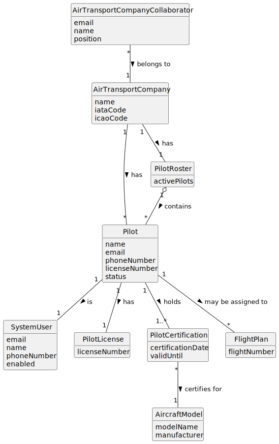

# US075 - Add a Pilot

## 2. Analysis

### 2.1. Relevant Domain Concepts

The relevant domain concepts for this user story are:

* **Air Transport Company Collaborator:** user associated with an air transport company and allowed to manage company resources.
* **Air Transport Company:** company that employs or registers the pilot.
* **Pilot:** person qualified to operate aircraft for an air transport company.
* **System User:** user account associated with the pilot, required for authentication and authorization.
* **Pilot License Number:** unique identifier of a pilot's aviation license.
* **Pilot Certification:** qualification that allows a pilot to operate a specific aircraft model.
* **Aircraft Model:** model of aircraft for which a pilot may be certified.
* **Email:** unique identifier of the corresponding system user.
* **Phone Number:** contact information associated with the pilot/system user.
* **Pilot Roster:** set of active pilots associated with an air transport company.

---

### 2.2. Business Rules

* Only an authorized Air Transport Company Collaborator can add pilots to their company.
* The collaborator must belong to the selected company.
* The selected air transport company must exist.
* A pilot must also be a distinct system user.
* A pilot must have a name.
* A pilot must have a valid email.
* The pilot email must be unique among system users.
* A pilot must have a phone number.
* A pilot must have a license number.
* The pilot license number must be unique.
* A pilot must be certified to pilot one or more aircraft models.
* Pilot certifications must reference existing aircraft models.
* A pilot must be associated with exactly one air transport company.
* A pilot should be active after registration.
* If pilot registration fails, no pilot, system user or certification should be stored.

---

### 2.3. Preconditions

* The Air Transport Company Collaborator must be authenticated.
* The collaborator must be authorized to add pilots.
* The collaborator must belong to the selected company.
* The selected company must exist.
* The pilot email must not already be used by another system user.
* The pilot license number must not already be used by another pilot.
* At least one selected aircraft model certification must reference an existing aircraft model.

---

### 2.4. Postconditions

**Successful pilot registration:**

* A new system user is created for the pilot.
* A new pilot is created.
* The pilot is associated with the selected air transport company.
* The pilot license number is unique in the system.
* The pilot is certified for one or more aircraft models.
* The pilot is active.
* The pilot can later access pilot-specific functionalities if authentication and authorization rules allow it.
* The pilot can later be assigned to flight plans if business rules allow it.

**Failed pilot registration:**

* No pilot is created.
* No system user is created.
* No pilot certification is created.
* The company remains unchanged.
* An error message is displayed.

---

### 2.5. Domain Model

