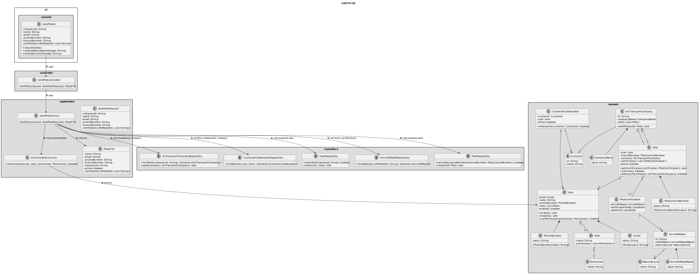
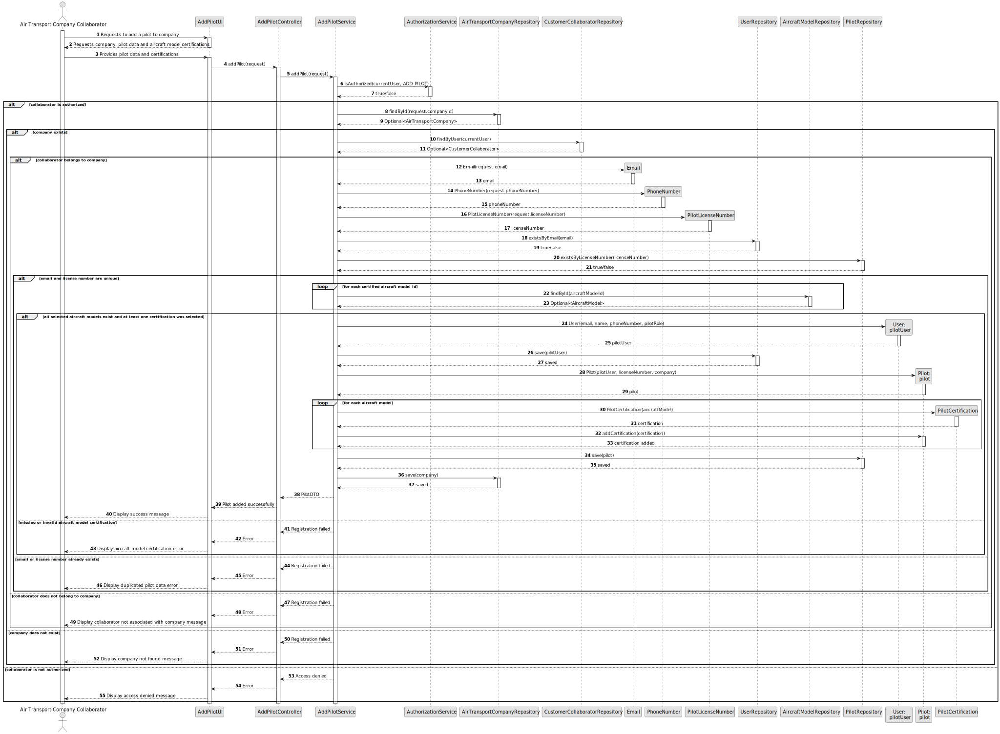

# US075 - Add a Pilot

## 3. Design

### 3.1. Responsibility Assignment

The pilot registration process is divided between the following components:

* **AddPilotUI:** interacts with the Air Transport Company Collaborator and collects pilot data and aircraft model certifications.
* **AddPilotController:** receives the registration request from the UI.
* **AddPilotService:** coordinates authorization, company validation, collaborator validation, user creation, aircraft model certification lookup and persistence.
* **AuthorizationService:** verifies if the current user has permission to add pilots.
* **AirTransportCompanyRepository:** retrieves and stores the selected company.
* **CustomerCollaboratorRepository:** verifies that the current user belongs to the selected company.
* **UserRepository:** checks email uniqueness and stores the corresponding system user.
* **AircraftModelRepository:** retrieves aircraft models used for pilot certifications.
* **PilotRepository:** checks license number uniqueness and stores the new pilot.
* **Pilot:** domain entity representing the pilot.
* **User:** domain entity representing the corresponding system user.
* **PilotLicenseNumber:** value object representing the unique pilot license number.
* **PilotCertification:** domain entity or value object representing certification for an aircraft model.
* **Email:** value object representing the pilot/system user email.
* **PhoneNumber:** value object representing the pilot/system user phone number.

---

### 3.2. Class Diagram

---

### 3.3. Sequence Diagram

---

### 3.4. Applied Patterns

* **UI:** responsible for collecting input from the Air Transport Company Collaborator.
* **Controller:** receives and delegates the request.
* **Service:** coordinates the use case.
* **Repository:** abstracts lookup and persistence.
* **Entity:** represents users, pilots, companies and aircraft models.
* **Value Object:** represents email, phone number and license number.
* **DTO:** transfers registered pilot data to the UI.

---

### 3.5. Design Remarks

* The UI must not access repositories directly.
* The Controller should not contain business rules.
* The Service should coordinate authorization, user creation, pilot creation, certification validation and persistence.
* The collaborator must belong to the company for which the pilot is being added.
* A pilot must be created as a system user.
* Pilot email uniqueness should be checked at system user level.
* Pilot license number uniqueness should be checked at pilot repository level.
* Pilot certifications should only reference existing aircraft models.
* The pilot must have at least one aircraft model certification.