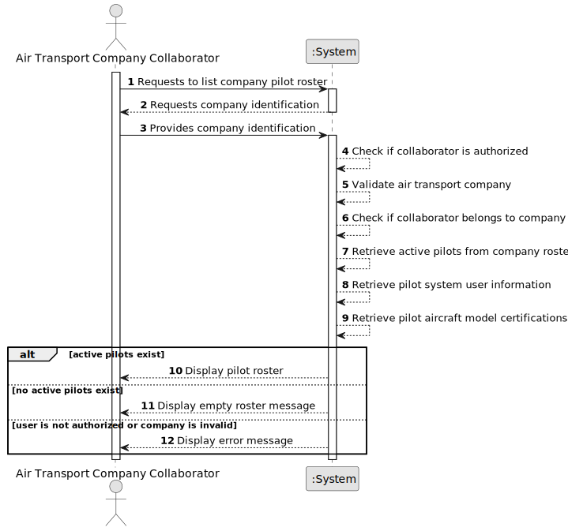

# US076 - List Pilot Roster

## 1. Requirements Engineering

### 1.1. User Story Description

As an Air Transport Company Collaborator, I want to list my company's pilot roster.

This functionality allows an authorized Air Transport Company Collaborator to consult the pilots associated with their company. Since a pilot is also a system user, the listing should include relevant system user information, such as name, email and phone number. Since pilots are certified to pilot one or more aircraft models, the listing should also show their aircraft model certifications.

---

### 1.2. Customer Specifications and Clarifications

**From the specifications document:**

* An Air Transport Company Collaborator can list their company's pilot roster.
* A pilot belongs to an air transport company.
* A pilot is a system's user.
* A pilot is certified to pilot one or more aircraft models.
* Authentication and authorization must be enforced for all users and functionalities.

**From the client clarifications:**

No additional client clarifications are currently available.

---

### 1.3. Acceptance Criteria

* **AC1:** An Air Transport Company Collaborator must be able to list their company's pilot roster.
* **AC2:** The collaborator must belong to the selected air transport company.
* **AC3:** The selected air transport company must exist.
* **AC4:** The list must include pilots associated with the selected company.
* **AC5:** The list should include only active pilots.
* **AC6:** Inactive pilots must not appear in the active pilot roster.
* **AC7:** The list must include each pilot's name.
* **AC8:** The list must include each pilot's email.
* **AC9:** The list must include each pilot's phone number.
* **AC10:** The list must include each pilot's license number.
* **AC11:** The list must include each pilot's aircraft model certifications.
* **AC12:** If the company has no active pilots, the system must display an appropriate empty roster message.
* **AC13:** Only an authenticated and authorized Air Transport Company Collaborator can list the pilot roster.
* **AC14:** The listing operation must not modify pilot, user or company data.

---

### 1.4. Found out Dependencies

* This user story depends on US030, because authentication and authorization must be enforced.
* This user story depends on US031, because pilots are also system users.
* This user story depends on US060, because the air transport company must exist.
* This user story depends on US061, because the actor must be a collaborator of the company.
* This user story depends on US075, because pilots must be added before they can be listed.
* This user story is related to US077, because inactive pilots should not appear in the active pilot roster.
* This user story is related to US080, because flight plans require pilots and their company/certification data.

---

### 1.5. Input and Output Data

**Input Data:**

* Selected data:
    * Air transport company

**Optional Input Data:**

Depending on future refinement, the listing may support:

* Aircraft model certification filter
* Pilot name filter
* License number filter
* Active/inactive status filter

**Output Data:**

* In case active pilots exist:
    * List of active pilots, including:
        * Name
        * Email
        * Phone number
        * License number
        * Aircraft model certifications

* In case no active pilots exist:
    * Empty pilot roster message

* In case of failure:
    * Error message explaining why the pilot roster could not be displayed

---

### 1.6. System Sequence Diagram

**_Other alternatives might exist._**

---

### 1.7. Other Relevant Remarks

* This is a read-only user story.
* A pilot is also a system user, so the roster should expose relevant user information.
* Inactive pilots should remain stored in the system but should not appear in the active pilot roster.
* The listing should expose pilot certifications because they are relevant for later flight plan validation.
* The listing operation must not modify pilot, user or company data.