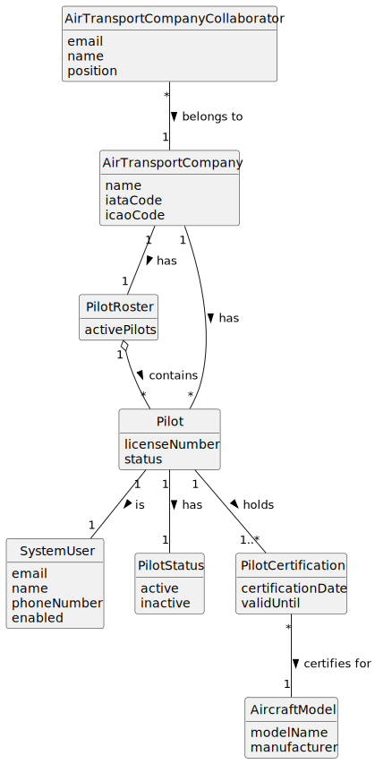

# US076 - List Pilot Roster

## 2. Analysis

### 2.1. Relevant Domain Concepts

The relevant domain concepts for this user story are:

* **Air Transport Company Collaborator:** user associated with an air transport company and allowed to consult company resources.
* **Air Transport Company:** company that has a roster of pilots.
* **Pilot Roster:** set of active pilots associated with an air transport company.
* **Pilot:** person qualified to operate aircraft for an air transport company.
* **System User:** user account associated with the pilot.
* **Pilot License Number:** unique identifier of a pilot's aviation license.
* **Pilot Certification:** qualification that allows a pilot to operate a specific aircraft model.
* **Aircraft Model:** model of aircraft for which a pilot may be certified.
* **Pilot Status:** indicates whether the pilot is active or inactive.

---

### 2.2. Business Rules

* Only an authorized Air Transport Company Collaborator can list their company's pilot roster.
* The collaborator must belong to the selected company.
* The selected air transport company must exist.
* Only pilots associated with the selected company may be listed.
* Only active pilots should be listed in the active pilot roster.
* Inactive pilots must not appear in the active pilot roster.
* Each listed pilot should include corresponding system user information.
* Each listed pilot should include aircraft model certifications.
* If the company has no active pilots, the system must return an empty roster or appropriate message.
* The listing operation must not modify pilot, user or company data.

---

### 2.3. Preconditions

* The Air Transport Company Collaborator must be authenticated.
* The collaborator must be authorized to list the pilot roster.
* The collaborator must belong to the selected company.
* The selected air transport company must exist.

---

### 2.4. Postconditions

**Successful listing with active pilots:**

* The system displays the active pilot roster of the selected company.
* Pilot data remains unchanged.
* System user data remains unchanged.
* Company data remains unchanged.

**Successful listing without active pilots:**

* The system displays an empty roster message.
* System state remains unchanged.

**Failed listing:**

* No pilot roster is displayed.
* System state remains unchanged.
* An error message is displayed.

---

### 2.5. Domain Model

