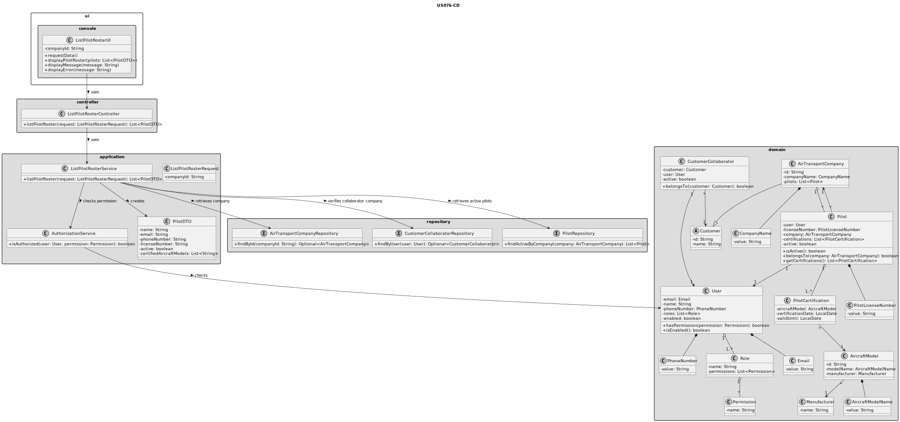
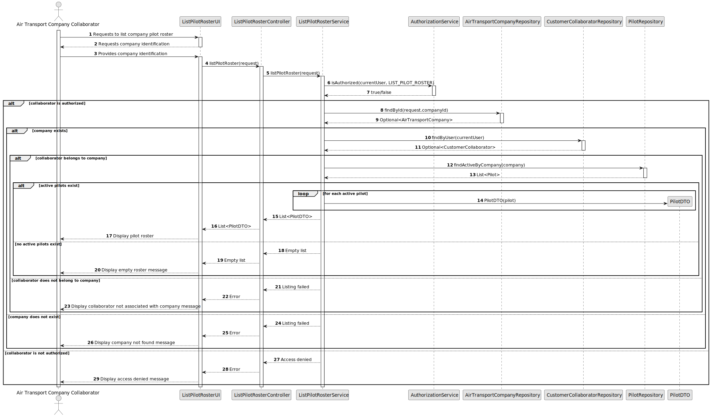

# US076 - List Pilot Roster

## 3. Design

### 3.1. Responsibility Assignment

The pilot roster listing process is divided between the following components:

* **ListPilotRosterUI:** interacts with the Air Transport Company Collaborator and collects the selected company.
* **ListPilotRosterController:** receives the list request from the UI.
* **ListPilotRosterService:** coordinates authorization, company validation, collaborator validation and pilot retrieval.
* **AuthorizationService:** verifies if the current user has permission to list the pilot roster.
* **AirTransportCompanyRepository:** retrieves the selected company.
* **CustomerCollaboratorRepository:** verifies that the current user belongs to the selected company.
* **PilotRepository:** retrieves active pilots associated with the selected company.
* **PilotDTO:** transports pilot information to the UI.
* **Pilot:** domain entity representing the pilot.
* **User:** domain entity representing the corresponding system user.
* **PilotCertification:** represents the aircraft model certifications shown in the roster.

---

### 3.2. Class Diagram

---

### 3.3. Sequence Diagram

---

### 3.4. Applied Patterns

* **UI:** responsible for collecting input and displaying the pilot roster.
* **Controller:** receives and delegates the request.
* **Service:** coordinates authorization and data retrieval.
* **Repository:** abstracts company, collaborator and pilot lookup.
* **DTO:** transfers pilot roster data to the UI.
* **Read-only Query:** retrieves data without modifying domain state.

---

### 3.5. Design Remarks

* The UI must not access repositories directly.
* The Controller should not contain business rules.
* The Service should coordinate authorization and retrieval.
* The collaborator must belong to the company whose pilot roster is being listed.
* Only active pilots should be returned.
* The DTO should include pilot system user information.
* The DTO should include pilot aircraft model certifications.
* The listing operation must be read-only.