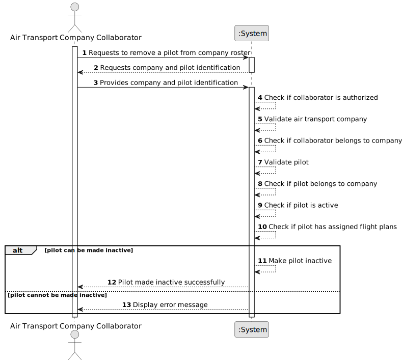

# US077 - Remove a Pilot

## 1. Requirements Engineering

### 1.1. User Story Description

As an Air Transport Company Collaborator, I want to make a pilot inactive in my company's roster.

This functionality allows an authorized Air Transport Company Collaborator to make a pilot inactive in their company's pilot roster. The pilot is not physically removed from the system. Instead, the pilot is marked as inactive and should no longer appear in the active pilot roster.

A pilot cannot be made inactive if there are flight plans assigned to that pilot.

---

### 1.2. Customer Specifications and Clarifications

**From the specifications document:**

* An Air Transport Company Collaborator can make a pilot inactive in their company's roster.
* A pilot cannot be deactivated if there are flight plans assigned.
* A pilot belongs to an air transport company.
* A pilot is a system's user.
* A pilot is certified to pilot one or more aircraft models.
* Authentication and authorization must be enforced for all users and functionalities.

**From the client clarifications:**

No additional client clarifications are currently available.

---

### 1.3. Acceptance Criteria

* **AC1:** An Air Transport Company Collaborator must be able to make a pilot inactive in their company's roster.
* **AC2:** The collaborator must belong to the selected air transport company.
* **AC3:** The selected air transport company must exist.
* **AC4:** The selected pilot must exist.
* **AC5:** The selected pilot must belong to the collaborator's company.
* **AC6:** The selected pilot must be active.
* **AC7:** The system must check whether the selected pilot has assigned flight plans.
* **AC8:** The system must not make the pilot inactive if there are flight plans assigned.
* **AC9:** If the operation succeeds, the pilot status must become inactive.
* **AC10:** An inactive pilot must not appear in the active pilot roster.
* **AC11:** An inactive pilot must not be available for future flight plan assignment.
* **AC12:** Making a pilot inactive must not physically delete the pilot from the system.
* **AC13:** Making a pilot inactive must preserve the associated system user and historical information.
* **AC14:** Only an authenticated and authorized Air Transport Company Collaborator can remove pilots from their company roster.
* **AC15:** The system must display a success message when the pilot is made inactive successfully.
* **AC16:** The system must display an error message when the operation fails.

---

### 1.4. Found out Dependencies

* This user story depends on US030, because authentication and authorization must be enforced.
* This user story depends on US031, because a pilot is also a system user.
* This user story depends on US060, because the air transport company must exist.
* This user story depends on US061, because the actor must be a collaborator of the company.
* This user story depends on US075, because pilots must be added before they can be removed from the active roster.
* This user story is related to US076, because inactive pilots should not appear in the active pilot roster.
* This user story is related to US080, because flight plans may be assigned to pilots and must block pilot deactivation.

---

### 1.5. Input and Output Data

**Input Data:**

* Selected data:
    * Air transport company
    * Pilot to make inactive

**Output Data:**

* In case of success:
    * Success message
    * Updated pilot status

* In case of failure:
    * Error message explaining why the pilot could not be made inactive

---

### 1.6. System Sequence Diagram

**_Other alternatives might exist._**

---

### 1.7. Other Relevant Remarks

* Removing a pilot means making the pilot inactive, not physically deleting the pilot.
* The pilot should remain stored in the system for historical and audit purposes.
* The associated system user should also remain stored.
* The pilot should not appear in the active pilot roster after being made inactive.
* Flight plans assigned to the pilot block the operation.