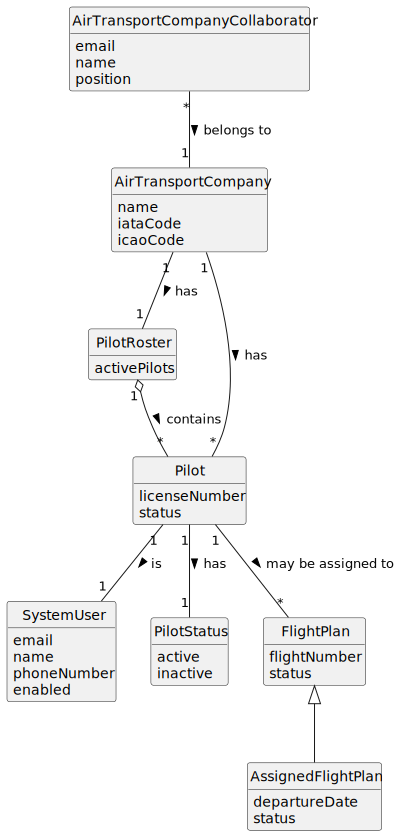

# US077 - Remove a Pilot

## 2. Analysis

### 2.1. Relevant Domain Concepts

The relevant domain concepts for this user story are:

* **Air Transport Company Collaborator:** user associated with an air transport company and allowed to manage company pilots.
* **Air Transport Company:** company that owns the pilot roster.
* **Pilot Roster:** set of active pilots associated with an air transport company.
* **Pilot:** person qualified to operate aircraft for an air transport company.
* **System User:** user account associated with the pilot.
* **Pilot Status:** indicates whether the pilot is active or inactive.
* **Flight Plan:** planned flight assignment that may reference a pilot.
* **Pilot Deactivation:** process of making a pilot inactive without deleting the pilot.

---

### 2.2. Business Rules

* Only an authorized Air Transport Company Collaborator can make a pilot inactive.
* The collaborator must belong to the selected company.
* The selected air transport company must exist.
* The selected pilot must exist.
* The selected pilot must belong to the selected company.
* Only active pilots can be made inactive.
* A pilot cannot be made inactive if there are flight plans assigned to that pilot.
* Making a pilot inactive must not physically delete the pilot.
* Making a pilot inactive must preserve the associated system user.
* An inactive pilot must not appear in the active pilot roster.
* An inactive pilot must not be available for future flight plan assignment.
* If the operation fails, the pilot status must remain unchanged.

---

### 2.3. Preconditions

* The Air Transport Company Collaborator must be authenticated.
* The collaborator must be authorized to remove pilots from the roster.
* The collaborator must belong to the selected company.
* The selected company must exist.
* The selected pilot must exist.
* The selected pilot must belong to the selected company.
* The selected pilot must be active.
* The selected pilot must not have assigned flight plans.

---

### 2.4. Postconditions

**Successful pilot removal:**

* The pilot status is changed to inactive.
* The pilot remains stored in the system.
* The associated system user remains stored.
* The pilot no longer appears in the active pilot roster.
* The pilot is no longer available for future flight plan assignment.

**Failed pilot removal:**

* The pilot status remains unchanged.
* The associated system user remains unchanged.
* No pilot data is removed.
* An error message is displayed.

---

### 2.5. Domain Model

