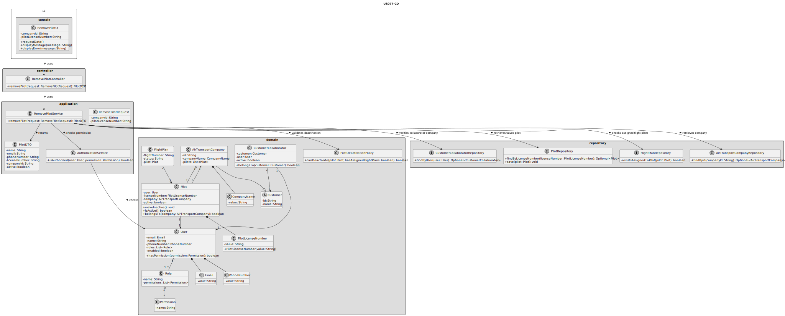
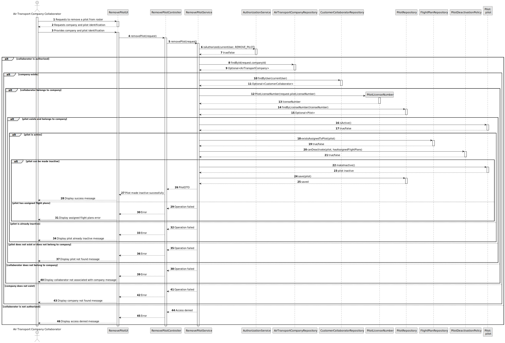

# US077 - Remove a Pilot

## 3. Design

### 3.1. Responsibility Assignment

The pilot removal process is divided between the following components:

* **RemovePilotUI:** interacts with the Air Transport Company Collaborator and collects the selected company and pilot.
* **RemovePilotController:** receives the request from the UI.
* **RemovePilotService:** coordinates authorization, company validation, collaborator validation, pilot lookup, flight plan validation and pilot status update.
* **AuthorizationService:** verifies if the current user has permission to remove pilots.
* **AirTransportCompanyRepository:** retrieves the selected company.
* **CustomerCollaboratorRepository:** verifies that the current user belongs to the selected company.
* **PilotRepository:** retrieves and stores the pilot.
* **FlightPlanRepository:** checks whether the pilot has assigned flight plans.
* **Pilot:** domain entity responsible for changing its own status.
* **PilotDeactivationPolicy:** domain policy responsible for checking whether the pilot can be made inactive.
* **PilotDTO:** transports updated pilot information to the UI.

---

### 3.2. Class Diagram

---

### 3.3. Sequence Diagram

---

### 3.4. Applied Patterns

* **UI:** responsible for collecting input from the Air Transport Company Collaborator.
* **Controller:** receives and delegates the request.
* **Service:** coordinates authorization, lookup, validation and persistence.
* **Repository:** abstracts company, collaborator, pilot and flight plan lookup.
* **Entity:** represents pilots and companies.
* **Domain Policy:** centralizes pilot deactivation rules.
* **State Change:** changes pilot status without physically deleting the pilot.
* **DTO:** transfers updated pilot data to the UI.

---

### 3.5. Design Remarks

* The UI must not access repositories directly.
* The Controller should not contain business rules.
* The Service should coordinate authorization, lookup, validation and persistence.
* The collaborator must belong to the company whose pilot is being removed.
* The pilot should expose a method such as `makeInactive()`.
* Flight plans assigned to the pilot must be checked before changing the pilot status.
* The pilot must remain stored in the system.
* The associated system user should remain stored.