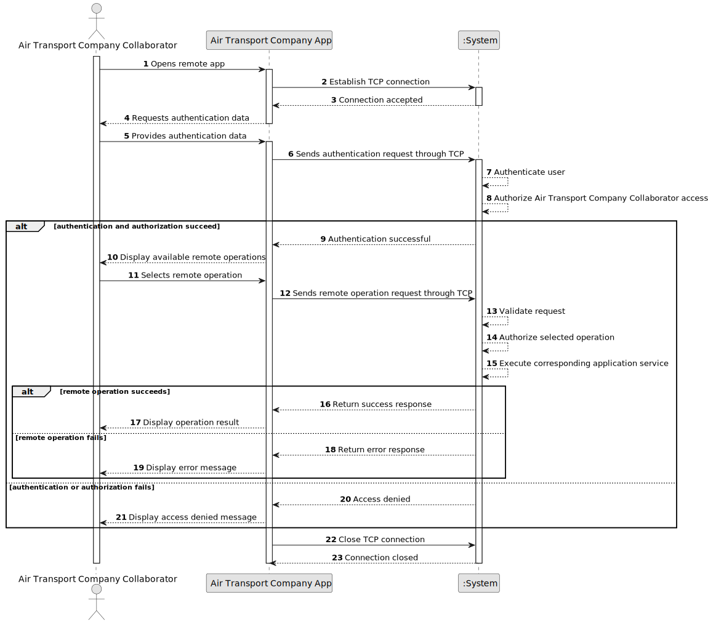

# US078 - Air Transport Company Collaborator Remote Access

## 1. Requirements Engineering

### 1.1. User Story Description

As an Air Transport Company Collaborator, I want to remotely access the system using the Air Transport Company App.

This functionality allows an Air Transport Company Collaborator to access the system remotely through a specific TCP-based client application. The client must communicate with a server application embedded in the system. The client must not interact directly with the database. All Air Transport Company Collaborator user stories must be available remotely through this client application.

---

### 1.2. Customer Specifications and Clarifications

**From the specifications document:**

* An Air Transport Company Collaborator wants to remotely access the system using the Air Transport Company App.
* A specific TCP-based network client application is required.
* The TCP client application must communicate with the server application embedded in the system.
* The client application interaction with the system must be limited to the TCP connection.
* Direct interaction with the database is unacceptable.
* All Air Transport Company Collaborator user stories must be remotely available by using this client application.
* Authentication and authorization must be enforced.

**From the client clarifications:**

No additional client clarifications are currently available.

---

### 1.3. Acceptance Criteria

* **AC1:** The Air Transport Company Collaborator must be able to remotely access the system using the Air Transport Company App.
* **AC2:** The Air Transport Company App must be a specific TCP-based network client application.
* **AC3:** The TCP client must communicate with a server application embedded in the system.
* **AC4:** The client application must interact with the system only through the TCP connection.
* **AC5:** The client application must not directly access the database.
* **AC6:** Authentication must be enforced before accessing protected operations.
* **AC7:** Authorization must be enforced for each remote operation.
* **AC8:** All Air Transport Company Collaborator user stories must be available remotely through the client application.
* **AC9:** Remote operations must use the same domain/application services as local operations whenever possible.
* **AC10:** The server must return success responses for valid requests.
* **AC11:** The server must return meaningful error responses for invalid requests.
* **AC12:** The server must handle unsupported or malformed requests gracefully.
* **AC13:** The TCP connection must be closed safely when the client exits or when an unrecoverable error occurs.

---

### 1.4. Found out Dependencies

* This user story depends on US030, because authentication and authorization must be enforced.
* This user story depends on US061, because the actor must be an Air Transport Company Collaborator.
* This user story depends on all Air Transport Company Collaborator user stories that must be exposed remotely:
    * US070 - Add an aircraft to an air transport company
    * US071 - Decommission an aircraft
    * US072 - List an air transport company's fleet
    * US072a - List fleet by model
    * US072b - List fleet by maker
    * US072c - List fleet by capacity
    * US072d - List fleet by age
    * US073 - Create a flight route
    * US074 - Delete a flight route
    * US075 - Add a pilot
    * US076 - List pilot roster
    * US077 - Remove a pilot
* This user story is related to US086, because pilots also need remote access through the Air Transport Company App.

---

### 1.5. Input and Output Data

**Input Data:**

* Authentication data:
    * User credentials or authentication token

* Remote request data:
    * Operation identifier
    * Request payload required by the selected user story

**Output Data:**

* In case of success:
    * Success response
    * Requested data or operation result

* In case of failure:
    * Error response explaining why the remote operation failed

---

### 1.6. System Sequence Diagram

**_Other alternatives might exist._**

---

### 1.7. Other Relevant Remarks

* This user story is mainly an access and communication user story.
* The remote app should not duplicate domain logic.
* The server should route remote requests to the same application services used by local UI flows whenever possible.
* The TCP client must never bypass the system by connecting directly to repositories or the database.
* The remote protocol should be simple, documented and testable.