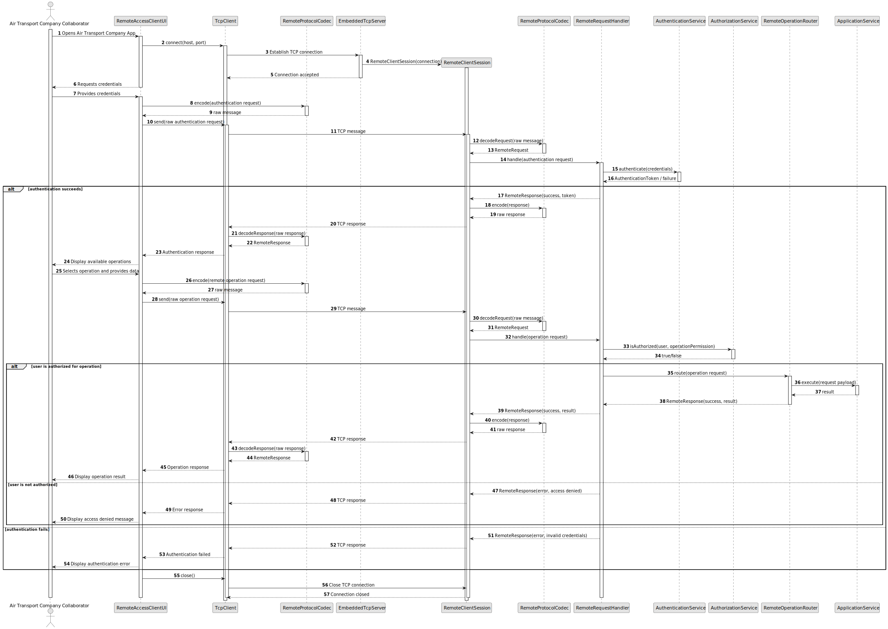

# US078 - Air Transport Company Collaborator Remote Access

## 3. Design

### 3.1. Responsibility Assignment

The remote access process is divided between the following components:

* **AirTransportCompanyApp:** TCP-based client application used by the Air Transport Company Collaborator.
* **RemoteAccessClientUI:** collects credentials, lets the user select operations and displays server responses.
* **TcpClient:** establishes and manages the TCP connection with the server application.
* **RemoteRequest:** represents a request sent by the client to the server.
* **RemoteResponse:** represents a response returned by the server to the client.
* **RemoteProtocolCodec:** serializes and deserializes remote requests and responses.
* **EmbeddedTcpServer:** server application embedded in the system that listens for TCP connections.
* **RemoteRequestHandler:** receives remote requests and routes them to the correct operation handler.
* **RemoteOperationRouter:** maps operation identifiers to application services.
* **AuthenticationService:** authenticates the remote user.
* **AuthorizationService:** checks whether the authenticated user may execute the requested operation.
* **Application Services:** execute the requested Air Transport Company Collaborator user stories.
* **Repositories:** access persistence from the server side only.

---

### 3.2. Class Diagram

---

### 3.3. Sequence Diagram

---

### 3.4. Applied Patterns

* **Client-Server:** separates the remote client app from the system server application.
* **TCP Communication:** supports remote interaction through a TCP connection.
* **Request/Response:** structures communication between client and server.
* **Router/Dispatcher:** maps remote operation identifiers to internal application services.
* **DTO:** transports data across the TCP boundary.
* **Service Layer:** executes use cases on the server side.
* **Repository:** remains server-side and inaccessible to the client.
* **Authentication and Authorization:** protect all remote operations.

---

### 3.5. Design Remarks

* The client app must not access repositories or the database.
* The server application must be responsible for all domain access.
* Remote operations should reuse the same application services as local UI use cases.
* The protocol should support success and error responses.
* Malformed or unsupported requests should not crash the server.
* Authentication should happen before protected operations.
* Authorization should be checked per operation.
* TCP connection handling should be isolated from domain logic.