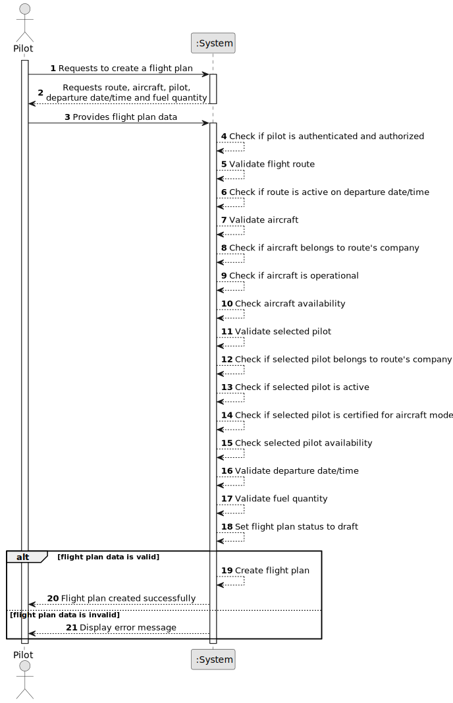

# US080 - Create a Flight Plan

## 1. Requirements Engineering

### 1.1. User Story Description

As a Pilot, I want to register a flight plan for a route.

This functionality allows an authenticated and authorized Pilot to create a flight plan for an existing flight route. The flight plan must include the aircraft, departure date/time, fuel quantity and pilot. The pilot must belong to the same air transport company as the selected route.

When the flight plan is created, its status must be set to "draft". The flight plan must later undergo a multi-step validation process before it can be considered validated or ready for use.

---

### 1.2. Customer Specifications and Clarifications

**From the specifications document:**

* A Pilot can register a flight plan for a route.
* The flight plan must include the aircraft.
* The flight plan must include the departure date/time.
* The flight plan must include the fuel quantity.
* The flight plan must include the pilot.
* The pilot must be of the route's company.
* The flight plan status is set to "draft" when created.
* The flight plan must undergo a multi-step validation process.
* Authentication and authorization must be enforced for all users and functionalities.

**From the client clarifications:**

No additional client clarifications are currently available.

---

### 1.3. Acceptance Criteria

* **AC1:** A Pilot must be able to register a flight plan for an existing route.
* **AC2:** The selected route must exist.
* **AC3:** The selected route must be active on the departure date/time.
* **AC4:** The selected aircraft must exist.
* **AC5:** The selected aircraft must belong to the same air transport company as the selected route.
* **AC6:** The selected aircraft must not be retired/decommissioned.
* **AC7:** The selected aircraft must be available for the selected departure date/time.
* **AC8:** The selected pilot must exist.
* **AC9:** The selected pilot must be active.
* **AC10:** The selected pilot must belong to the same air transport company as the selected route.
* **AC11:** The selected pilot must be certified to pilot the selected aircraft's model.
* **AC12:** The selected pilot must be available for the selected departure date/time.
* **AC13:** The flight plan must include a departure date/time.
* **AC14:** The departure date/time must be valid.
* **AC15:** The flight plan must include a fuel quantity.
* **AC16:** The fuel quantity must be positive.
* **AC17:** The fuel quantity must not exceed the aircraft model's maximum fuel capacity.
* **AC18:** The flight plan status must be set to "draft" when created.
* **AC19:** The created flight plan must be stored.
* **AC20:** The flight plan must later undergo a multi-step validation process.
* **AC21:** Only an authenticated and authorized Pilot can create flight plans.
* **AC22:** The system must display a success message when the flight plan is created successfully.
* **AC23:** The system must display an error message when flight plan creation fails.

---

### 1.4. Found out Dependencies

* This user story depends on US030, because authentication and authorization must be enforced.
* This user story depends on US075, because pilots must exist and be system users.
* This user story depends on US077, because inactive pilots must not be used in new flight plans.
* This user story depends on US070, because aircraft must exist before being assigned to flight plans.
* This user story depends on US071, because retired/decommissioned aircraft must not be used in new flight plans.
* This user story depends on US073, because flight plans are created for existing flight routes.
* This user story depends on US074, because deactivated routes must not accept new flight plans from the deactivation date onwards.
* This user story is related to US081, because flight plans can later be created from a file.
* This user story is related to US082, because weather data can later be added to a flight plan.
* This user story is related to US083, because the Flight DSL will formally describe flight plans.
* This user story is related to US085, because created flight plans must later be tested/validated.
* This user story is related to US086, because Pilot user stories must be remotely available.

---

### 1.5. Input and Output Data

**Input Data:**

* Selected data:
    * Flight route
    * Aircraft
    * Pilot

* Typed data:
    * Departure date/time
    * Fuel quantity

**Optional Input Data:**

Depending on future refinement, the flight plan may also include:

* Flight designator
* Flight type
* Scheduled arrival time
* Notes or operational remarks

**Output Data:**

* In case of success:
    * Success message
    * Created flight plan information
    * Flight plan status set to "draft"

* In case of failure:
    * Error message explaining why the flight plan could not be created

---

### 1.6. System Sequence Diagram

**_Other alternatives might exist._**

---

### 1.7. Other Relevant Remarks

* The actor of this user story is Pilot, not Air Transport Company Collaborator.
* The pilot is also a system user.
* The selected pilot must belong to the same company as the selected route.
* The selected aircraft must belong to the same company as the selected route.
* The created flight plan starts in "draft" status.
* The multi-step validation process is not completed in this user story; it is prepared for later validation user stories.