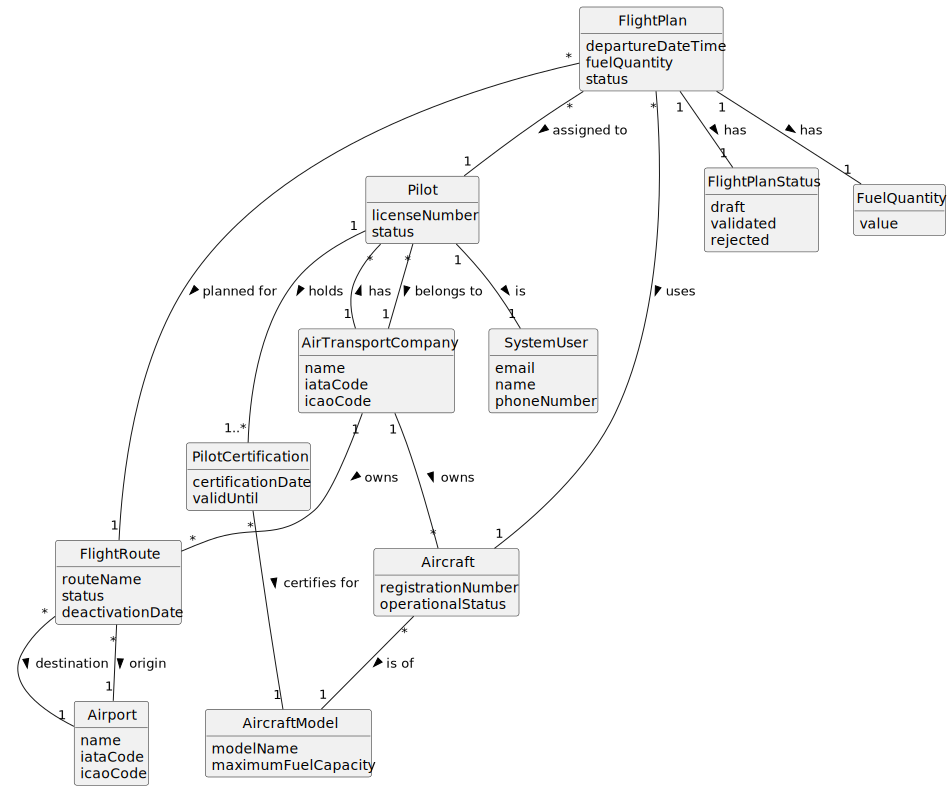

# US080 - Create a Flight Plan

## 2. Analysis

### 2.1. Relevant Domain Concepts

The relevant domain concepts for this user story are:

* **Pilot:** system user who creates the flight plan.
* **Flight Plan:** planned flight execution for a selected route.
* **Flight Route:** route between two airports, owned by an air transport company.
* **Air Transport Company:** company that owns the route, aircraft and pilot roster.
* **Aircraft:** aircraft selected for the flight plan.
* **Aircraft Model:** model of the selected aircraft, relevant for fuel capacity and pilot certification.
* **Departure Date/Time:** scheduled start time of the flight.
* **Fuel Quantity:** quantity of fuel planned for the flight.
* **Flight Plan Status:** state of the flight plan, initially "draft".
* **Pilot Certification:** certification that allows a pilot to operate a specific aircraft model.
* **Multi-step Validation Process:** later validation process that the flight plan must undergo.

---

### 2.2. Business Rules

* Only an authenticated and authorized Pilot can create flight plans.
* The selected route must exist.
* The selected route must be active on the selected departure date/time.
* The selected aircraft must exist.
* The selected aircraft must belong to the same company as the selected route.
* The selected aircraft must be operational.
* The selected aircraft must be available for the selected departure date/time.
* The selected pilot must exist.
* The selected pilot must be active.
* The selected pilot must belong to the same company as the selected route.
* The selected pilot must be certified to pilot the selected aircraft's model.
* The selected pilot must be available for the selected departure date/time.
* The departure date/time must be valid.
* The fuel quantity must be positive.
* The fuel quantity must not exceed the aircraft model's maximum fuel capacity.
* The flight plan status must be set to "draft" when the flight plan is created.
* The flight plan must later undergo a multi-step validation process.
* If flight plan creation fails, no flight plan should be stored.

---

### 2.3. Preconditions

* The Pilot must be authenticated.
* The Pilot must be authorized to create flight plans.
* The selected route must exist.
* The selected aircraft must exist.
* The selected pilot must exist.
* The selected pilot and aircraft must belong to the same company as the selected route.
* The route must be active on the selected departure date/time.
* The aircraft and pilot must be available for the selected departure date/time.

---

### 2.4. Postconditions

**Successful flight plan creation:**

* A new flight plan is created.
* The flight plan is associated with the selected route.
* The flight plan is associated with the selected aircraft.
* The flight plan is associated with the selected pilot.
* The flight plan stores departure date/time and fuel quantity.
* The flight plan status is set to "draft".
* The flight plan can later undergo multi-step validation.

**Failed flight plan creation:**

* No flight plan is created.
* Route, aircraft and pilot data remain unchanged.
* An error message is displayed.

---

### 2.5. Domain Model

