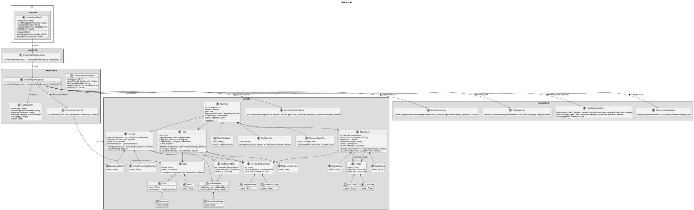
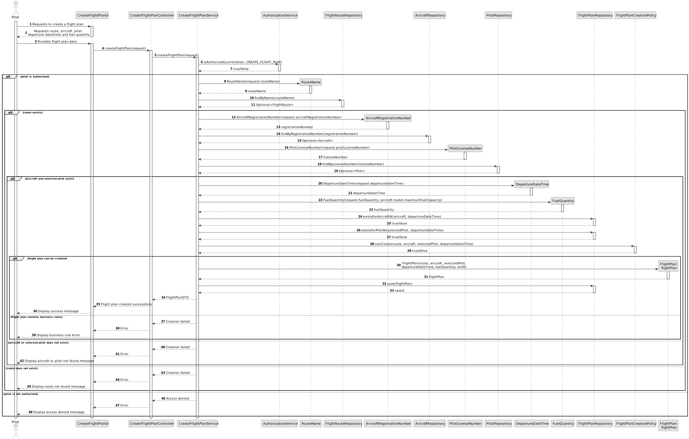

# US080 - Create a Flight Plan

## 3. Design

### 3.1. Responsibility Assignment

The flight plan creation process is divided between the following components:

* **CreateFlightPlanUI:** interacts with the Pilot and collects flight plan data.
* **CreateFlightPlanController:** receives the request from the UI.
* **CreateFlightPlanService:** coordinates authorization, route validation, aircraft validation, pilot validation and flight plan persistence.
* **AuthorizationService:** verifies if the current user has permission to create flight plans.
* **FlightRouteRepository:** retrieves the selected route.
* **AircraftRepository:** retrieves the selected aircraft and checks availability.
* **PilotRepository:** retrieves the selected pilot and checks availability.
* **FlightPlanRepository:** stores the created flight plan and checks existing assignments.
* **FlightPlan:** domain entity representing the flight plan.
* **FuelQuantity:** value object responsible for validating fuel quantity.
* **DepartureDateTime:** value object responsible for validating departure date/time.
* **FlightPlanStatus:** value object or enum representing the current status of the flight plan.
* **FlightPlanCreationPolicy:** domain policy responsible for validating cross-entity business rules.

---

### 3.2. Class Diagram

---

### 3.3. Sequence Diagram

---

### 3.4. Applied Patterns

* **UI:** responsible for collecting input from the Pilot.
* **Controller:** receives and delegates the request.
* **Service:** coordinates the use case.
* **Repository:** abstracts route, aircraft, pilot and flight plan persistence.
* **Entity:** represents flight plans, routes, aircraft and pilots.
* **Value Object:** represents fuel quantity, departure date/time and status.
* **Domain Policy:** centralizes cross-entity flight plan creation rules.
* **DTO:** transfers created flight plan data to the UI.

---

### 3.5. Design Remarks

* The UI must not access repositories directly.
* The Controller should not contain business rules.
* The Service should coordinate authorization, lookup, validation and persistence.
* The selected pilot must belong to the same company as the selected route.
* The selected aircraft must belong to the same company as the selected route.
* The selected pilot must be certified for the selected aircraft's model.
* The selected route must be active on the departure date/time.
* The selected aircraft and pilot must be available for the departure date/time.
* The created flight plan must start with status `draft`.
* This user story creates the flight plan but does not execute the later multi-step validation process.