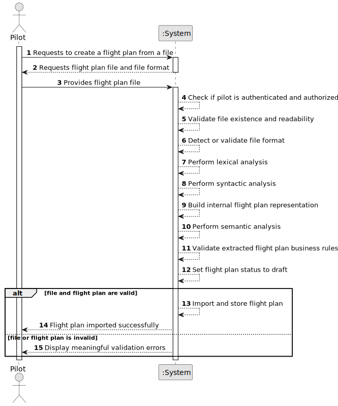

# US081 - Create a Flight Plan from a File

## 1. Requirements Engineering

### 1.1. User Story Description

As a Pilot, I want to create a flight plan from a file.

This functionality allows an authenticated and authorized Pilot to import a flight plan from a file. The file must conform to the Core Flight DSL. Before being used by the system, the file must be validated through lexical, syntactic and semantic analysis.

Only valid flight plans may be imported and used by the system. Invalid files must not create or modify flight plans and must produce meaningful error messages.

---

### 1.2. Customer Specifications and Clarifications

**From the specifications document:**

* A Pilot can create a flight plan from a file.
* There may be multiple file formats.
* The file format must be validated before the file is used.
* The flight plan file must conform to the Core Flight DSL.
* The file must be validated through lexical analysis.
* The file must be validated through syntactic analysis.
* The file must be validated through semantic analysis.
* Invalid files must produce meaningful error messages.
* Only valid flight plans may be imported and used by the system.
* Authentication and authorization must be enforced for all users and functionalities.

**From the client clarifications:**

No additional client clarifications are currently available.

---

### 1.3. Acceptance Criteria

* **AC1:** A Pilot must be able to import/create a flight plan from a file.
* **AC2:** The Pilot must be authenticated.
* **AC3:** The Pilot must be authorized to import flight plans.
* **AC4:** The uploaded/imported file must exist and be readable.
* **AC5:** The file format must be supported by the system.
* **AC6:** The file content must conform to the Core Flight DSL.
* **AC7:** The system must perform lexical analysis on the file.
* **AC8:** The system must perform syntactic analysis on the file.
* **AC9:** The system must perform semantic analysis on the file.
* **AC10:** Lexical errors must prevent the flight plan from being imported.
* **AC11:** Syntactic errors must prevent the flight plan from being imported.
* **AC12:** Semantic errors must prevent the flight plan from being imported.
* **AC13:** Invalid files must produce meaningful error messages.
* **AC14:** Only valid flight plans may be imported and used by the system.
* **AC15:** A valid imported flight plan must respect the same business rules as US080.
* **AC16:** A successfully imported flight plan must be stored with status `draft`, unless a later validation user story defines otherwise.
* **AC17:** The system must not create a flight plan if file validation fails.
* **AC18:** The system must display a success message when the flight plan is imported successfully.
* **AC19:** The system must display an error message when import fails.

---

### 1.4. Found out Dependencies

* This user story depends on US030, because authentication and authorization must be enforced.
* This user story depends on US080, because the imported file ultimately creates a flight plan.
* This user story depends on US083, because the file must conform to the Core Flight DSL and must be validated through lexical, syntactic and semantic analysis.
* This user story is related to US082, because weather data may later be added to the imported flight plan.
* This user story is related to US085, because imported flight plans must later be tested/validated.
* This user story is related to US086, because Pilot user stories must be remotely available.

---

### 1.5. Input and Output Data

**Input Data:**

* Selected data:
    * Flight plan file
    * File format, if not automatically detected

**Implicit/Input Data extracted from the file:**

Depending on the Core Flight DSL, the file may include:

* Route identifier/name
* Aircraft registration number
* Pilot identifier/license number
* Departure date/time
* Fuel quantity
* Flight path data
* Altitude information
* Additional operational information defined by the DSL

**Output Data:**

* In case of success:
    * Success message
    * Imported flight plan information
    * Flight plan status

* In case of failure:
    * Meaningful error message, including:
        * Error type
        * File location, when available
        * Description of the issue

---

### 1.6. System Sequence Diagram

**_Other alternatives might exist._**

---

### 1.7. Other Relevant Remarks

* This user story imports a flight plan from a file, but it must not bypass the normal business rules for creating flight plans.
* The DSL validation process should produce meaningful errors for lexical, syntactic and semantic failures.
* The parser/validator should not persist any flight plan until the file is fully valid.
* Although multiple formats may exist in the future, the required baseline is the Core Flight DSL.