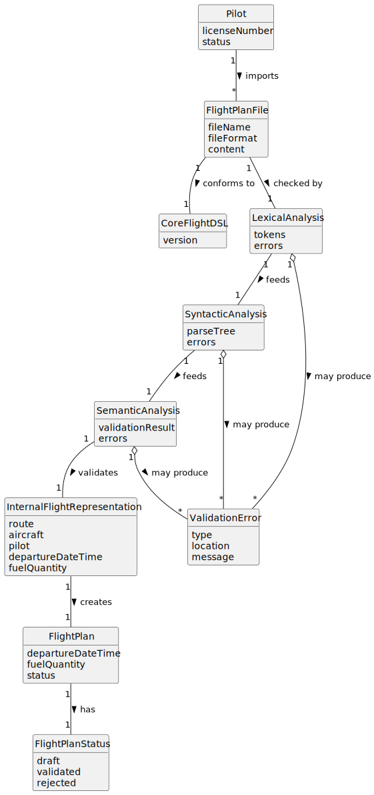

# US081 - Create a Flight Plan from a File

## 2. Analysis

### 2.1. Relevant Domain Concepts

The relevant domain concepts for this user story are:

* **Pilot:** system user who imports the flight plan.
* **Flight Plan File:** external file containing a flight plan description.
* **File Format:** representation format of the imported file.
* **Core Flight DSL:** required domain-specific language used to describe flight plans.
* **Lexical Analysis:** validation stage that checks whether the input is composed of valid tokens.
* **Syntactic Analysis:** validation stage that checks whether the tokens follow the grammar of the DSL.
* **Semantic Analysis:** validation stage that checks whether the parsed content makes sense in the system domain.
* **Internal Representation:** AST or domain object representation produced after parsing.
* **Flight Plan:** domain entity created from the valid file content.
* **Validation Error:** meaningful error returned when the file is invalid.

---

### 2.2. Business Rules

* Only an authenticated and authorized Pilot can import flight plans from files.
* The file must exist and be readable.
* The file format must be supported.
* The file must conform to the Core Flight DSL.
* The file must pass lexical analysis.
* The file must pass syntactic analysis.
* The file must pass semantic analysis.
* Invalid files must not create flight plans.
* Invalid files must produce meaningful error messages.
* Only valid flight plans may be imported and used by the system.
* The imported flight plan must respect the same domain rules as manually created flight plans.
* A successfully imported flight plan should be stored with status `draft`.
* If import fails, the system state must remain unchanged.

---

### 2.3. Preconditions

* The Pilot must be authenticated.
* The Pilot must be authorized to import flight plans.
* The flight plan file must be available.
* The file must be readable.
* The file format must be supported.
* The Core Flight DSL grammar and validator must be available.

---

### 2.4. Postconditions

**Successful import:**

* The file is validated lexically, syntactically and semantically.
* An internal representation is produced.
* A flight plan is created from the valid representation.
* The flight plan is stored.
* The flight plan status is set to `draft`.

**Failed import:**

* No flight plan is created.
* No flight plan is stored.
* Meaningful validation errors are displayed.
* The system state remains unchanged.

---

### 2.5. Domain Model

