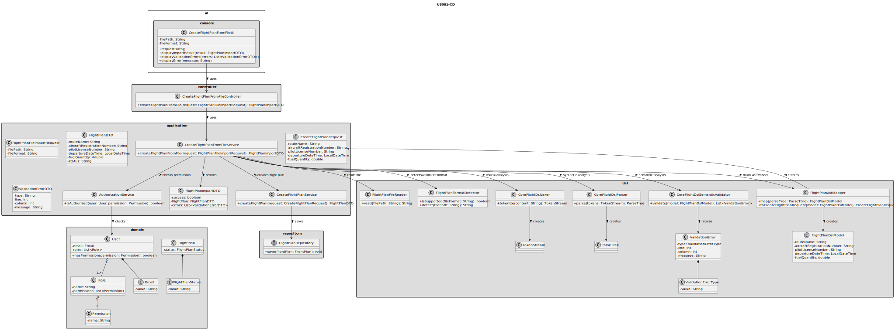
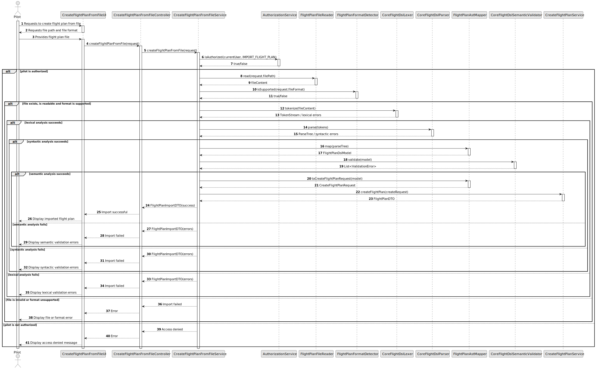

# US081 - Create a Flight Plan from a File

## 3. Design

### 3.1. Responsibility Assignment

The flight plan file import process is divided between the following components:

* **CreateFlightPlanFromFileUI:** interacts with the Pilot and collects the file path/file.
* **CreateFlightPlanFromFileController:** receives the import request from the UI.
* **CreateFlightPlanFromFileService:** coordinates authorization, file validation, DSL parsing, semantic validation and flight plan creation.
* **AuthorizationService:** verifies if the current user has permission to import flight plans.
* **FlightPlanFileReader:** reads the file content.
* **FlightPlanFormatDetector:** detects or validates the file format.
* **CoreFlightDslLexer:** performs lexical analysis.
* **CoreFlightDslParser:** performs syntactic analysis.
* **CoreFlightDslSemanticValidator:** performs semantic analysis.
* **FlightPlanAstMapper:** maps the parsed DSL structure to an internal flight plan representation.
* **CreateFlightPlanService:** reuses the normal flight plan creation rules from US080.
* **FlightPlanRepository:** stores the created flight plan.
* **ValidationError:** represents lexical, syntactic or semantic errors.

---

### 3.2. Class Diagram

---

### 3.3. Sequence Diagram

---

### 3.4. Applied Patterns

* **UI:** responsible for collecting the flight plan file from the Pilot.
* **Controller:** receives and delegates the request.
* **Service:** coordinates the import process.
* **Parser/Lexer:** validates the Core Flight DSL.
* **Semantic Validator:** validates domain meaning after parsing.
* **Mapper:** converts DSL representation into application request/domain data.
* **Reuse of Application Service:** delegates final flight plan creation to the US080 service.
* **DTO:** transfers import results and errors to the UI.
* **Error Reporting:** provides meaningful validation messages.

---

### 3.5. Design Remarks

* The import service must not persist a flight plan until all validation stages succeed.
* Lexical, syntactic and semantic errors should be distinguished.
* Semantic validation should check domain references and business constraints.
* The final creation should reuse `CreateFlightPlanService` whenever possible.
* This avoids duplicating the business rules already defined for US080.
* Multiple file formats may be supported later, but the Core Flight DSL is mandatory.