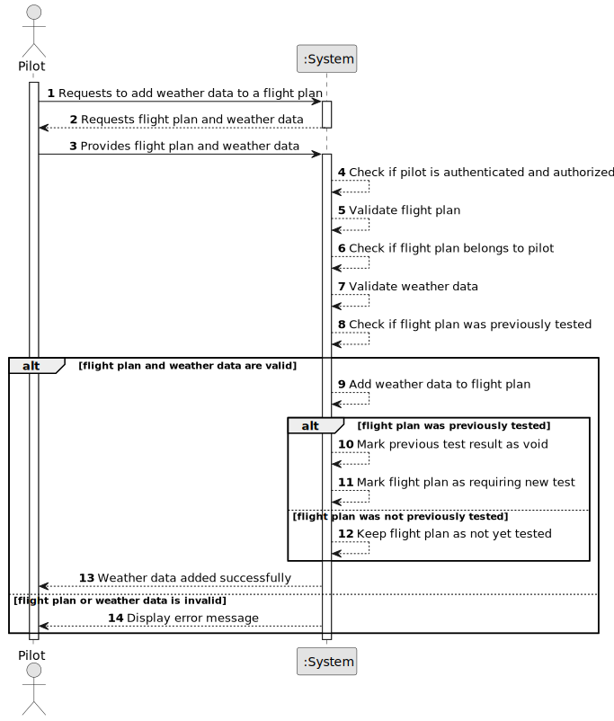

# US082 - Insert Weather Data in a Flight

## 1. Requirements Engineering

### 1.1. User Story Description

As a Pilot, I want to add weather data to a flight plan of mine.

This functionality allows an authenticated and authorized Pilot to add weather data to one of their own flight plans. The weather data becomes part of the flight plan information and may influence later validation or simulation steps.

If the flight plan has already been tested, adding or changing weather data makes the previous test result void, because the flight plan conditions have changed.

---

### 1.2. Customer Specifications and Clarifications

**From the specifications document:**

* A Pilot can add weather data to a flight plan of theirs.
* If the flight plan has been previously tested, the test is deemed void because of the new weather data.
* A Pilot can create flight plans.
* Flight plans must undergo validation/testing.
* Weather data can be consulted in the system by a Pilot for a given day and air control area.
* Authentication and authorization must be enforced for all users and functionalities.

**From the client clarifications:**

No additional client clarifications are currently available.

---

### 1.3. Acceptance Criteria

* **AC1:** A Pilot must be able to add weather data to one of their own flight plans.
* **AC2:** The Pilot must be authenticated.
* **AC3:** The Pilot must be authorized to update the selected flight plan.
* **AC4:** The selected flight plan must exist.
* **AC5:** The selected flight plan must belong to the authenticated Pilot.
* **AC6:** The weather data must be provided.
* **AC7:** The weather data must be valid.
* **AC8:** The weather data must be associated with the selected flight plan.
* **AC9:** If the flight plan had not been previously tested, the weather data must be added without invalidating any test result.
* **AC10:** If the flight plan had been previously tested, the previous test result must be marked as void.
* **AC11:** After weather data is changed, the flight plan must require a new validation/test before being considered tested again.
* **AC12:** The system must preserve historical information about the voided test, if applicable.
* **AC13:** The system must display a success message when weather data is added successfully.
* **AC14:** The system must display an error message when the operation fails.

---

### 1.4. Found out Dependencies

* This user story depends on US030, because authentication and authorization must be enforced.
* This user story depends on US075, because the actor is a Pilot and a Pilot is a system user.
* This user story depends on US080, because a flight plan must exist before weather data can be added.
* This user story is related to US043, because weather data may be consulted in the system by a Pilot.
* This user story is related to US041 and US042, because weather data may originate from registered or imported weather data.
* This user story is related to US085, because changing weather data voids a previous test/validation result.
* This user story is related to US086, because Pilot user stories must be remotely available.

---

### 1.5. Input and Output Data

**Input Data:**

* Selected data:
    * Flight plan

* Typed or selected weather data:
    * Weather data reference, if selected from existing weather records
    * Or manually provided weather data, depending on implementation

**Possible weather data fields:**

Depending on the final weather model, weather data may include:

* Air control area
* Date/time
* Wind speed
* Wind direction
* Temperature
* Pressure
* Humidity
* Visibility
* Precipitation
* Storm or severe weather indicators

**Output Data:**

* In case of success:
    * Success message
    * Updated flight plan information
    * Weather data associated with the flight plan
    * Test status updated to void, if applicable

* In case of failure:
    * Error message explaining why the weather data could not be added

---

### 1.6. System Sequence Diagram

**_Other alternatives might exist._**

---

### 1.7. Other Relevant Remarks

* This user story changes the flight plan conditions.
* Weather data should not be added to flight plans belonging to another Pilot.
* If the flight plan was previously tested, the previous test result must no longer be considered valid.
* The flight plan should require a new test after weather data is added or changed.
* This operation should not delete previous test data; it should mark the test as void or invalidated.