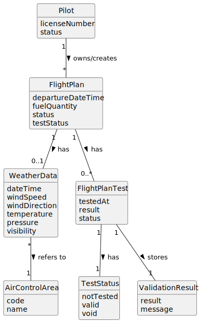

# US082 - Insert Weather Data in a Flight

## 2. Analysis

### 2.1. Relevant Domain Concepts

The relevant domain concepts for this user story are:

* **Pilot:** system user who owns or is assigned to the flight plan.
* **Flight Plan:** planned flight execution to which weather data will be added.
* **Weather Data:** meteorological information associated with the flight plan.
* **Flight Plan Test:** previous test/validation result of a flight plan.
* **Voided Test:** test result that is no longer valid because the flight plan conditions changed.
* **Flight Plan Status:** state of the flight plan, which may be affected by weather data changes.
* **Air Control Area:** area for which weather data may be relevant.
* **Weather Time Reference:** date/time associated with weather information.

---

### 2.2. Business Rules

* Only an authenticated and authorized Pilot can add weather data to a flight plan.
* The flight plan must exist.
* The flight plan must belong to the Pilot.
* Weather data must be valid.
* Weather data must be associated with the selected flight plan.
* Adding weather data changes the conditions of the flight plan.
* If the flight plan was previously tested, the previous test must be deemed void.
* A voided test must no longer be considered a valid test result.
* After weather data is added to a previously tested flight plan, the flight plan must require a new test.
* If the flight plan was not previously tested, no test needs to be voided.
* The operation must preserve previous test history where relevant.
* If the operation fails, the flight plan must remain unchanged.

---

### 2.3. Preconditions

* The Pilot must be authenticated.
* The Pilot must be authorized to add weather data.
* The selected flight plan must exist.
* The selected flight plan must belong to the Pilot.
* The weather data must be provided.
* The weather data must be valid.

---

### 2.4. Postconditions

**Successful weather data insertion on untested flight plan:**

* Weather data is associated with the flight plan.
* No test result is voided.
* The flight plan remains not yet tested or still pending validation.

**Successful weather data insertion on previously tested flight plan:**

* Weather data is associated with the flight plan.
* The previous test result is marked as void.
* The flight plan requires a new test/validation.

**Failed weather data insertion:**

* No weather data is added.
* No test result is voided.
* The flight plan remains unchanged.
* An error message is displayed.

---

### 2.5. Domain Model

