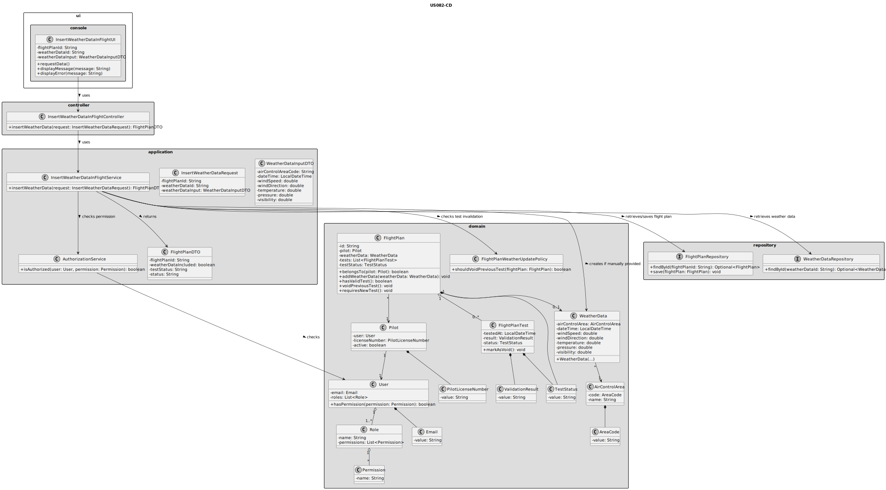
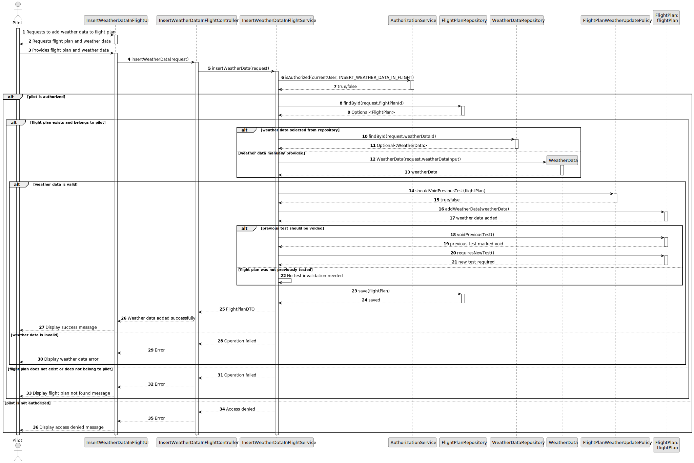

# US082 - Insert Weather Data in a Flight

## 3. Design

### 3.1. Responsibility Assignment

The weather data insertion process is divided between the following components:

* **InsertWeatherDataInFlightUI:** interacts with the Pilot and collects the selected flight plan and weather data.
* **InsertWeatherDataInFlightController:** receives the request from the UI.
* **InsertWeatherDataInFlightService:** coordinates authorization, flight plan lookup, weather data validation, update and test invalidation.
* **AuthorizationService:** verifies if the current user has permission to update flight plans.
* **FlightPlanRepository:** retrieves and stores the flight plan.
* **WeatherDataRepository:** retrieves existing weather data if the user selects already registered weather data.
* **WeatherData:** domain object representing meteorological information.
* **FlightPlan:** domain entity responsible for associating weather data and invalidating previous test results.
* **FlightPlanTest:** domain entity representing a previous test result.
* **FlightPlanWeatherUpdatePolicy:** domain policy responsible for deciding whether previous test results must be voided.

---

### 3.2. Class Diagram

---

### 3.3. Sequence Diagram

---

### 3.4. Applied Patterns

* **UI:** responsible for collecting input from the Pilot.
* **Controller:** receives and delegates the request.
* **Service:** coordinates authorization, lookup, validation and persistence.
* **Repository:** abstracts flight plan and weather data persistence.
* **Entity:** represents flight plans and tests.
* **Value Object / Domain Object:** represents weather data.
* **Domain Policy:** centralizes weather update and test invalidation rules.
* **DTO:** transfers updated flight plan information to the UI.

---

### 3.5. Design Remarks

* The UI must not access repositories directly.
* The Controller should not contain business rules.
* The Service should coordinate authorization, lookup, validation, update and persistence.
* The flight plan should expose a method such as `addWeatherData(weatherData)`.
* If the flight plan was previously tested, the test result should be marked as void.
* The previous test result should not be deleted.
* The flight plan should require a new test after weather data is changed.