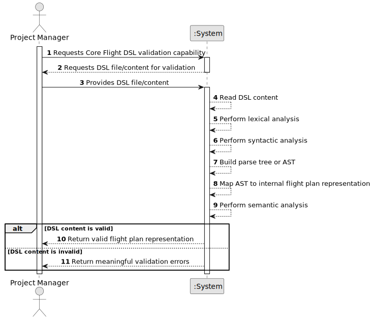

# US083 - Core Flight DSL

## 1. Requirements Engineering

### 1.1. User Story Description

As a Project Manager, I want the team to define and implement a Core Flight DSL to describe flight plans.

This functionality defines the domain-specific language used to represent flight plans in files. The DSL must describe the essential data required to create a flight plan and must support validation before the flight plan is imported into the system.

The DSL must support lexical analysis, syntactic analysis and semantic analysis. Only flight plan files that are valid according to the Core Flight DSL and the system's business rules may later be imported and used.

---

### 1.2. Customer Specifications and Clarifications

**From the specifications document:**

* Flight plan files must conform to the Core Flight DSL.
* The system must validate flight plan files before using them.
* Validation must include lexical analysis.
* Validation must include syntactic analysis.
* Validation must include semantic analysis.
* Invalid files must produce meaningful error messages.
* Only valid flight plans may be imported and used by the system.
* Authentication and authorization must be enforced for protected functionalities.

**From the client clarifications:**

No additional client clarifications are currently available.

---

### 1.3. Acceptance Criteria

* **AC1:** The team must define a Core Flight DSL to represent flight plans.
* **AC2:** The DSL must support the information required to create a flight plan.
* **AC3:** The DSL must allow representing the route.
* **AC4:** The DSL must allow representing the aircraft.
* **AC5:** The DSL must allow representing the pilot.
* **AC6:** The DSL must allow representing the departure date/time.
* **AC7:** The DSL must allow representing the fuel quantity.
* **AC8:** The DSL must have a formal grammar or equivalent specification.
* **AC9:** The system must perform lexical analysis over DSL files.
* **AC10:** The system must perform syntactic analysis over DSL files.
* **AC11:** The system must perform semantic analysis over parsed DSL files.
* **AC12:** Lexical errors must be identified and reported meaningfully.
* **AC13:** Syntactic errors must be identified and reported meaningfully.
* **AC14:** Semantic errors must be identified and reported meaningfully.
* **AC15:** The DSL parser must produce an internal representation of a valid flight plan file.
* **AC16:** The internal representation must be convertible into a flight plan creation request.
* **AC17:** A semantically valid DSL file must respect the same business rules used when creating a flight plan manually.
* **AC18:** Invalid DSL files must not result in a created flight plan.
* **AC19:** The DSL implementation must be reusable by the flight plan import functionality.

---

### 1.4. Found out Dependencies

* This user story is related to US080, because the DSL must represent the data needed to create a flight plan.
* This user story is a dependency of US081, because imported flight plan files must conform to the Core Flight DSL.
* This user story is related to US082, because weather data may later become part of an extended flight plan representation.
* This user story is related to US085, because tested/validated flight plans depend on correct flight plan data.
* This user story is related to US086, because Pilot user stories must be remotely available, including operations that may use DSL-based flight plans.

---

### 1.5. Input and Output Data

**Input Data:**

* DSL file content

**Possible DSL Elements:**

Depending on the final grammar, the Core Flight DSL should include:

* Route name
* Aircraft registration number
* Pilot license number
* Departure date/time
* Fuel quantity

**Output Data:**

* In case of successful lexical analysis:
    * Token stream

* In case of successful syntactic analysis:
    * Parse tree or AST

* In case of successful semantic analysis:
    * Valid internal flight plan representation

* In case of failure:
    * List of meaningful validation errors, including:
        * Error type
        * Line
        * Column
        * Message

---

### 1.6. System Sequence Diagram

**_Other alternatives might exist._**

---

### 1.7. Other Relevant Remarks

* This user story defines the DSL and validation pipeline.
* This user story does not necessarily import a flight plan by itself; that is handled by US081.
* The DSL should be small, explicit and easy to test.
* Semantic validation should not be confused with syntax validation.
* A syntactically correct file can still be semantically invalid.