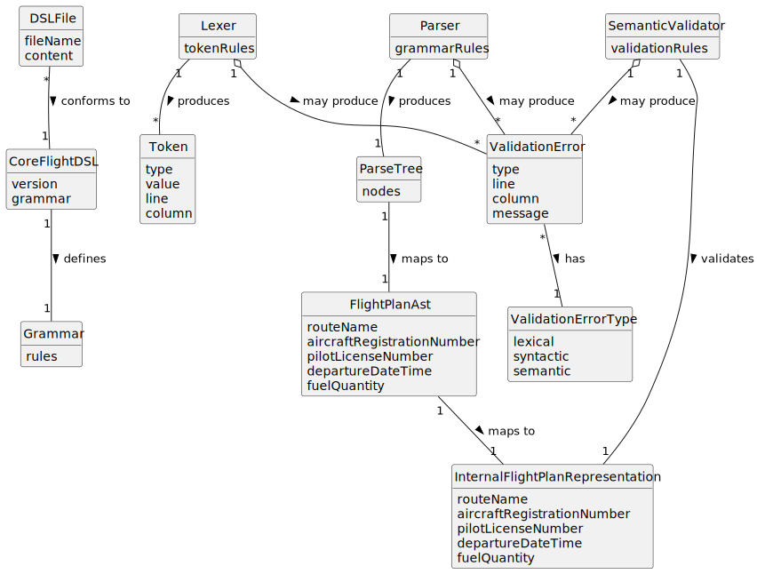

# US083 - Core Flight DSL

## 2. Analysis

### 2.1. Relevant Domain Concepts

The relevant domain concepts for this user story are:

* **Core Flight DSL:** domain-specific language used to describe flight plans.
* **DSL File:** file containing a flight plan written in the Core Flight DSL.
* **Lexical Analysis:** validation phase that transforms raw text into tokens and detects invalid symbols or token patterns.
* **Token:** minimal recognized unit of the DSL.
* **Syntactic Analysis:** validation phase that verifies whether tokens follow the grammar.
* **Parse Tree / AST:** structured representation produced after syntactic analysis.
* **Semantic Analysis:** validation phase that verifies whether the parsed flight plan makes sense in the system domain.
* **Internal Flight Plan Representation:** intermediate model extracted from the DSL before creating a flight plan.
* **Validation Error:** meaningful error describing why DSL content is invalid.
* **Grammar:** formal definition of the DSL syntax.

---

### 2.2. Business Rules

* The Core Flight DSL must be able to describe the data required for a flight plan.
* DSL files must be validated before they are imported.
* Lexical analysis must happen before syntactic analysis.
* Syntactic analysis must happen before semantic analysis.
* Lexical errors must prevent syntactic and semantic validation.
* Syntactic errors must prevent semantic validation.
* Semantic errors must prevent conversion into a valid flight plan creation request.
* A syntactically valid DSL file may still be semantically invalid.
* Meaningful validation errors must be produced for invalid DSL content.
* The DSL validation pipeline must not persist flight plans.
* The resulting internal representation must be usable by US081.

---

### 2.3. Preconditions

* The Core Flight DSL grammar must be defined.
* The DSL content must be available.
* The lexer must be able to read the DSL content.
* The parser must be able to process the produced tokens.
* The semantic validator must have access to the necessary domain validation rules.

---

### 2.4. Postconditions

**Successful DSL validation:**

* The DSL content is tokenized.
* The token stream is parsed.
* A parse tree or AST is produced.
* An internal flight plan representation is created.
* The internal representation is semantically valid.

**Failed DSL validation:**

* No valid internal flight plan representation is produced.
* No flight plan is created.
* Meaningful validation errors are returned.

---

### 2.5. Domain Model

